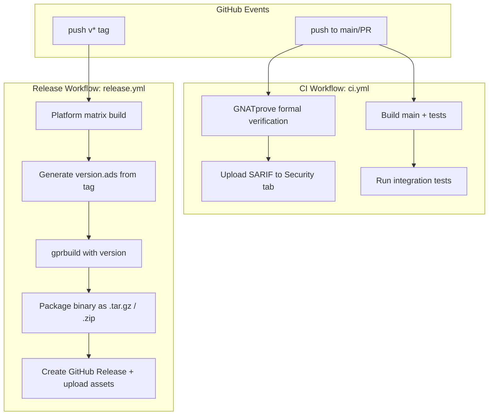
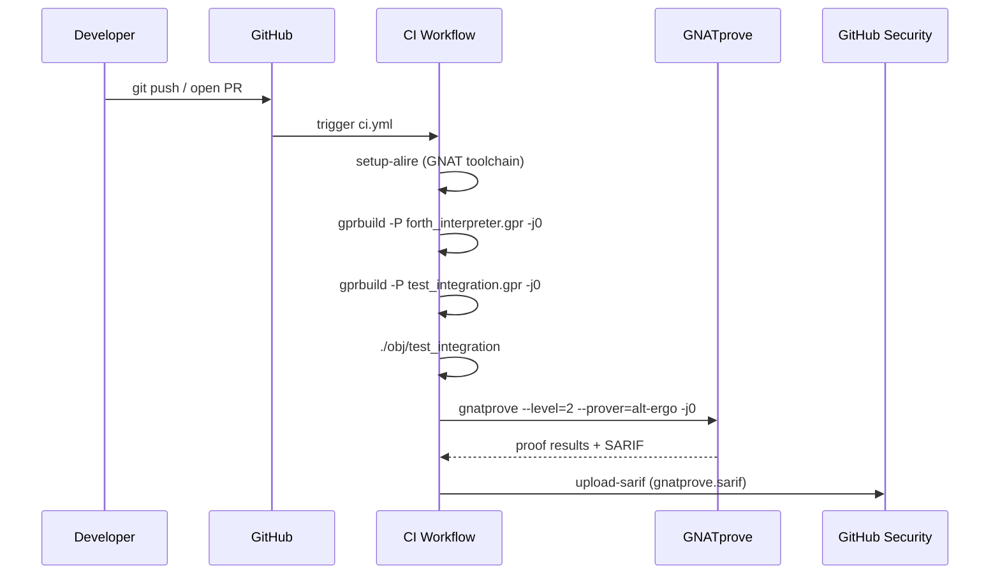
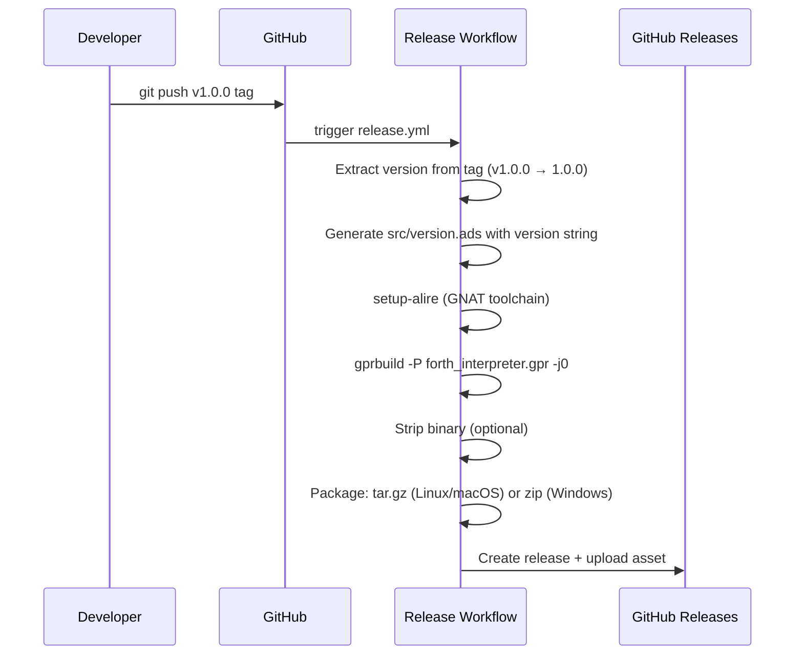

# Design Document: CI/CD Releases

## Overview

This feature adds a GitHub Actions CI/CD pipeline to the Ada/SPARK Forth interpreter project, enabling automated builds, SPARK formal verification, and binary releases. The pipeline triggers on every push and pull request for CI (build + prove), and additionally creates GitHub Releases with pre-built binaries when a `v`-prefixed git tag is pushed (e.g., `v1.0.0`). Version information is embedded into the binary at build time via a generated Ada spec file, allowing the interpreter to print its version with a `--version` flag.

Initially, only Linux amd64 is active for builds and releases. Other platforms (Linux aarch64, macOS amd64/aarch64, Windows amd64) are defined in the workflow matrix but commented out, ready to be enabled when cross-compilation toolchains are validated.

A `doc/release_process.md` file documents the step-by-step release workflow for maintainers.

## Architecture



## Sequence Diagrams

### CI Flow (push / PR)



### Release Flow (tag push)



## Components and Interfaces

### Component 1: Version Package (`src/version.ads`)

**Purpose**: Provides a compile-time version string to the main binary. This file is generated by CI during release builds, and a default exists in the repository for local development.

```ada
--  src/version.ads
--  This file is overwritten by CI during release builds.
package Version
  with SPARK_Mode => Off
is
   Name    : constant String := "ada-forth";
   Value   : constant String := "dev";
   --  CI replaces "dev" with the tag version, e.g., "1.0.0"
end Version;
```

**Responsibilities**:
- Provide version string accessible from main.adb
- Default to "dev" for local builds
- Overwritten by CI with actual tag version during release builds

### Component 2: Main Entry Point Changes (`src/main.adb`)

**Purpose**: Add `--version` flag handling before entering the REPL loop.

```ada
--  Added to main.adb (SPARK_Mode => Off)
with Ada.Command_Line;
with Version;

--  Before the REPL loop:
if Ada.Command_Line.Argument_Count > 0
  and then Ada.Command_Line.Argument (1) = "--version"
then
   Ada.Text_IO.Put_Line (Version.Name & " " & Version.Value);
   return;
end if;
```

**Responsibilities**:
- Check for `--version` argument
- Print version and exit without entering REPL
- No impact on SPARK-verified code (main.adb is SPARK_Mode => Off)

### Component 3: CI Workflow (`.github/workflows/ci.yml`)

**Purpose**: Continuous integration on every push/PR — build, test, prove, upload SARIF. Branches containing `sandbox` in their name are excluded to avoid consuming runner time during exploratory development.

**Responsibilities**:
- Exclude branches matching `*sandbox*` from triggering CI (via `branches-ignore` filter)
- Install GNAT toolchain via `alire-project/setup-alire@v2`
- Build main binary and test binary (gprbuild -j0 to use all cores)
- Run integration tests
- Run GNATprove formal verification (gnatprove -j0 to use all cores)
- Convert GNATprove output to SARIF format
- Upload SARIF to GitHub Security tab
- Cache GNATprove proof sessions for faster re-runs

### Component 4: Release Workflow (`.github/workflows/release.yml`)

**Purpose**: Build and publish binary releases when a `v*` tag is pushed.

**Responsibilities**:
- Trigger on `v*` tag push
- Extract version string from git tag
- Generate `src/version.ads` with embedded version
- Build optimized binary for each platform in matrix (gprbuild -j0 to use all cores)
- Package binary into `.tar.gz` (Linux/macOS) or `.zip` (Windows)
- Create GitHub Release and upload assets
- Matrix includes all platforms but only Linux amd64 is uncommented initially

### Component 5: Release Documentation (`doc/release_process.md`)

**Purpose**: Step-by-step guide for maintainers to cut a release.

**Responsibilities**:
- Document version bump process
- Document tag creation and push
- Document how to verify the release in GitHub Actions
- Document how to download binaries from GitHub Releases
- Document manual local build instructions

## Data Models

### Platform Matrix Entry

```ada
--  Conceptual model for the workflow matrix
type Platform_Entry is record
   Name       : String;  --  e.g., "linux-amd64"
   Runner     : String;  --  e.g., "ubuntu-latest"
   Target     : String;  --  e.g., "x86_64-linux"
   Archive    : String;  --  "tar.gz" or "zip"
   Extension  : String;  --  "" or ".exe"
end record;
```

### Active Platform Configuration (YAML matrix)

| Platform | Runner | Archive | Status |
|----------|--------|---------|--------|
| linux-amd64 | ubuntu-latest | tar.gz | Active |
| linux-aarch64 | ubuntu-24.04-arm | tar.gz | Commented |
| macos-amd64 | macos-13 | tar.gz | Commented |
| macos-aarch64 | macos-latest | tar.gz | Commented |
| windows-amd64 | windows-latest | zip | Commented |

### Version String Format

- Tag format: `v<major>.<minor>.<patch>` (e.g., `v1.0.0`)
- Extracted version: `<major>.<minor>.<patch>` (e.g., `1.0.0`)
- Default (local dev): `"dev"`


## Algorithmic Pseudocode

### Version Generation Algorithm (CI step)

```ada
--  Executed as a shell step in the release workflow
--  Input: GITHUB_REF_NAME = "v1.0.0"
--  Output: src/version.ads with Value => "1.0.0"

--  Step 1: Extract version from tag
--    VERSION="${GITHUB_REF_NAME#v}"  -- strips leading 'v'

--  Step 2: Generate Ada spec file
--    cat > src/version.ads <<EOF
--    package Version
--      with SPARK_Mode => Off
--    is
--       Name  : constant String := "ada-forth";
--       Value : constant String := "${VERSION}";
--    end Version;
--    EOF
```

**Preconditions:**
- `GITHUB_REF_NAME` matches pattern `v[0-9]+\.[0-9]+\.[0-9]+`
- `src/` directory exists in the checkout

**Postconditions:**
- `src/version.ads` contains the extracted version string
- The file is valid Ada 2012 syntax
- `gprbuild` can compile the project with the generated file

### SARIF Conversion Algorithm

```ada
--  GNATprove produces results in its own format.
--  We need to convert to SARIF for GitHub Security tab upload.
--
--  Approach: Use gnatprove's --output=sarif flag if available,
--  or use a post-processing script to convert the JSON output.
--
--  gnatprove -P forth_interpreter.gpr --level=2 --prover=alt-ergo -j0 \
--    --report=all --output-msg-only 2>&1 | tee gnatprove_output.log
--
--  Then convert to SARIF format for upload.
```

**Preconditions:**
- GNATprove has completed successfully
- Proof results are available in `obj/gnatprove/`

**Postconditions:**
- A valid SARIF file exists for upload
- All proof results (proved and unproved) are represented

### Binary Packaging Algorithm

```ada
--  Package the built binary for distribution
--
--  Input: compiled binary at obj/ada-forth (or obj/ada-forth.exe on Windows)
--         (GPR file sets Executable("main.adb") => "ada-forth")
--  Output: ada-forth-{version}-{platform}.tar.gz or .zip

--  Step 1: Create staging directory
--    mkdir -p staging/ada-forth-{version}

--  Step 2: Copy binary
--    cp obj/ada-forth staging/ada-forth-{version}/ada-forth
--    (or ada-forth.exe on Windows)

--  Step 3: Copy documentation
--    cp README.md staging/ada-forth-{version}/

--  Step 4: Create archive
--    Linux/macOS: tar czf ada-forth-{version}-{platform}.tar.gz \
--                   -C staging ada-forth-{version}
--    Windows:     cd staging && zip -r ../ada-forth-{version}-{platform}.zip \
--                   ada-forth-{version}
```

**Preconditions:**
- Binary exists at `obj/ada-forth` (or `obj/ada-forth.exe`)
- Version and platform name are known

**Postconditions:**
- Archive file exists with correct naming convention
- Archive contains the binary with the canonical name `ada-forth`
- Archive contains README.md

## Key Functions with Formal Specifications

### Function 1: Version Embedding

```ada
package Version
  with SPARK_Mode => Off
is
   Name  : constant String := "ada-forth";
   Value : constant String := "dev";
   --  Invariant: Value is either "dev" or matches "[0-9]+\.[0-9]+\.[0-9]+"
end Version;
```

**Preconditions:**
- File exists in `src/` directory
- File is valid Ada 2012

**Postconditions:**
- `Version.Value` returns a non-empty string
- `Version.Name` returns `"ada-forth"`

### Function 2: Command-Line Version Check

```ada
--  In main.adb, before REPL loop:
procedure Main is
begin
   if Ada.Command_Line.Argument_Count > 0
     and then Ada.Command_Line.Argument (1) = "--version"
   then
      Ada.Text_IO.Put_Line (Version.Name & " " & Version.Value);
      return;
   end if;

   --  ... existing REPL code ...
end Main;
```

**Preconditions:**
- `Ada.Command_Line` is available (standard library)
- `Version` package is compiled and linked
- GPR file maps `main.adb` to executable name `ada-forth` via `for Executable ("main.adb") use "ada-forth"`

**Postconditions:**
- If `--version` is passed: prints version string and exits with code 0
- If no `--version`: enters REPL as before (no behavioral change)

## Example Usage

### Local Development Build

```bash
# Build locally (version.ads has "dev" default)
gprbuild -P forth_interpreter.gpr -j0
./obj/ada-forth --version
# Output: ada-forth dev

# Normal REPL usage unchanged
./obj/ada-forth
> 3 4 + .
 7  OK
```

### Creating a Release

```bash
# 1. Ensure version.ads default is "dev" (committed)
# 2. Commit all changes
git add -A && git commit -m "Prepare release v1.0.0"

# 3. Create and push tag
git tag v1.0.0
git push origin main --tags

# 4. GitHub Actions triggers release.yml
#    - Generates version.ads with "1.0.0"
#    - Builds binary
#    - Creates GitHub Release with ada-forth-1.0.0-linux-amd64.tar.gz

# 5. Download and verify
tar xzf ada-forth-1.0.0-linux-amd64.tar.gz
./ada-forth-1.0.0/ada-forth --version
# Output: ada-forth 1.0.0
```

### CI Workflow Trigger

```bash
# Every push/PR triggers ci.yml (except sandbox branches):
git push origin feature-branch
# → Builds project
# → Runs integration tests (55 tests)
# → Runs GNATprove (424 VCs)
# → Uploads SARIF to GitHub Security tab

# Sandbox branches skip CI entirely:
git push origin sandbox/experiment
# → No CI triggered
```

## Correctness Properties

*A property is a characteristic or behavior that should hold true across all valid executions of a system — essentially, a formal statement about what the system should do. Properties serve as the bridge between human-readable specifications and machine-verifiable correctness guarantees.*

### Property 1: Version embedding round-trip

*For any* valid git tag matching `v<major>.<minor>.<patch>`, generating `src/version.ads` from that tag and then compiling and running the binary with `--version` shall produce output containing exactly `<major>.<minor>.<patch>`.

**Validates: Requirements 1.2, 2.1, 5.2, 5.3**

### Property 2: Version generation idempotence

*For any* valid git tag, running the version generation step N times (N ≥ 1) with the same tag shall produce byte-identical `src/version.ads` content each time.

**Validates: Requirement 5.4**

### Property 3: Archive format matches platform

*For any* Platform_Matrix entry, if the platform OS is Linux or macOS then the archive format shall be `.tar.gz`, and if the platform OS is Windows then the archive format shall be `.zip`.

**Validates: Requirements 6.2, 6.3**

## Error Handling

### Error Scenario 1: Tag Format Invalid

**Condition**: A tag is pushed that doesn't match `v*` pattern or has malformed version.
**Response**: Release workflow doesn't trigger (filtered by `tags: ['v*']`). If tag matches `v*` but version extraction yields empty string, the workflow should fail early with a clear error message.
**Recovery**: Delete the bad tag, create a correctly formatted one.

### Error Scenario 2: GNATprove Finds Unproved VCs

**Condition**: Code changes introduce unproved verification conditions.
**Response**: CI workflow fails. SARIF upload still occurs so unproved VCs appear in GitHub Security tab.
**Recovery**: Developer fixes proof failures before merging.

### Error Scenario 3: Build Failure on a Platform

**Condition**: gprbuild fails on one platform in the release matrix.
**Response**: That platform's job fails. Other platform jobs continue independently. GitHub Release is not created if any required job fails.
**Recovery**: Fix the platform-specific build issue and push a new tag.

### Error Scenario 4: setup-alire Fails

**Condition**: The Alire toolchain setup action fails (network issue, version unavailable).
**Response**: Job fails with clear error from the action.
**Recovery**: Retry the workflow, or pin to a known-good toolchain version.

## Testing Strategy

### Unit Testing Approach

- Existing 55 integration tests in `test_integration.adb` run in CI on every push
- Version printing tested by building and running `./obj/ada-forth --version` in CI
- Version output validated: `./obj/ada-forth --version | grep -q "ada-forth"` as a CI step

### Property-Based Testing Approach

- Not applicable for CI/CD configuration files
- SPARK formal verification (GNATprove) serves as the property-based testing equivalent for the Ada code — 424 VCs covering all runtime properties

### Integration Testing Approach

- CI workflow tested by pushing to a branch and verifying all jobs pass
- Release workflow tested by pushing a test tag (e.g., `v0.0.1-test`) to verify the full release pipeline
- SARIF upload verified by checking GitHub Security tab after CI run
- Binary archive verified by downloading and extracting in a separate CI step

## Security Considerations

- SARIF upload exposes proof results in GitHub Security tab — this is intentional and useful for visibility
- Release binaries are built from the exact tagged commit (no manual intervention possible)
- `setup-alire` action pinned to `v2` — consider pinning to a specific SHA for supply chain security
- No secrets required for public repository releases (uses `GITHUB_TOKEN` automatically)
- Version string injection is safe: tag name is validated by git and GitHub, no shell injection possible with the `${GITHUB_REF_NAME#v}` pattern

## Dependencies

| Dependency | Purpose | Version |
|------------|---------|---------|
| `alire-project/setup-alire` | Install GNAT/GNATprove toolchain | `v2` |
| `actions/checkout` | Check out repository | `v4` |
| `actions/upload-artifact` | Upload build artifacts | `v4` |
| `actions/cache` | Cache GNATprove proof sessions | `v4` |
| `github/codeql-action/upload-sarif` | Upload SARIF to Security tab | `v3` |
| `softprops/action-gh-release` | Create GitHub Release + upload assets | `v2` |
| GNAT Community / GNAT Pro | Ada 2012 compiler | Latest via Alire |
| GNATprove | SPARK formal verification | Latest via Alire |
| alt-ergo | SMT solver for proofs | Bundled with GNATprove |
