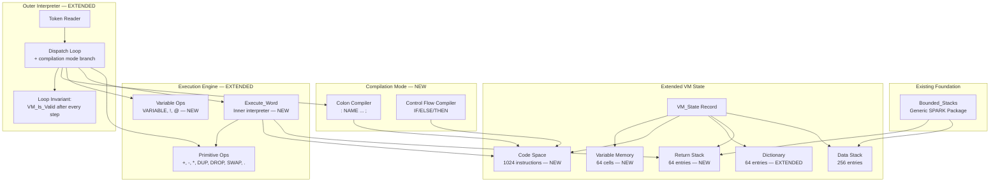
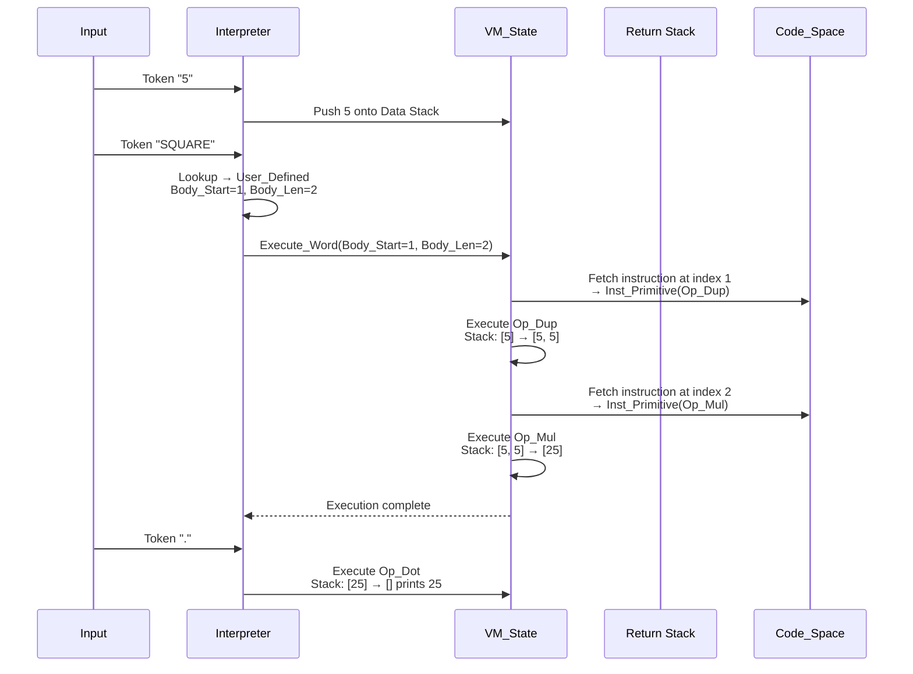
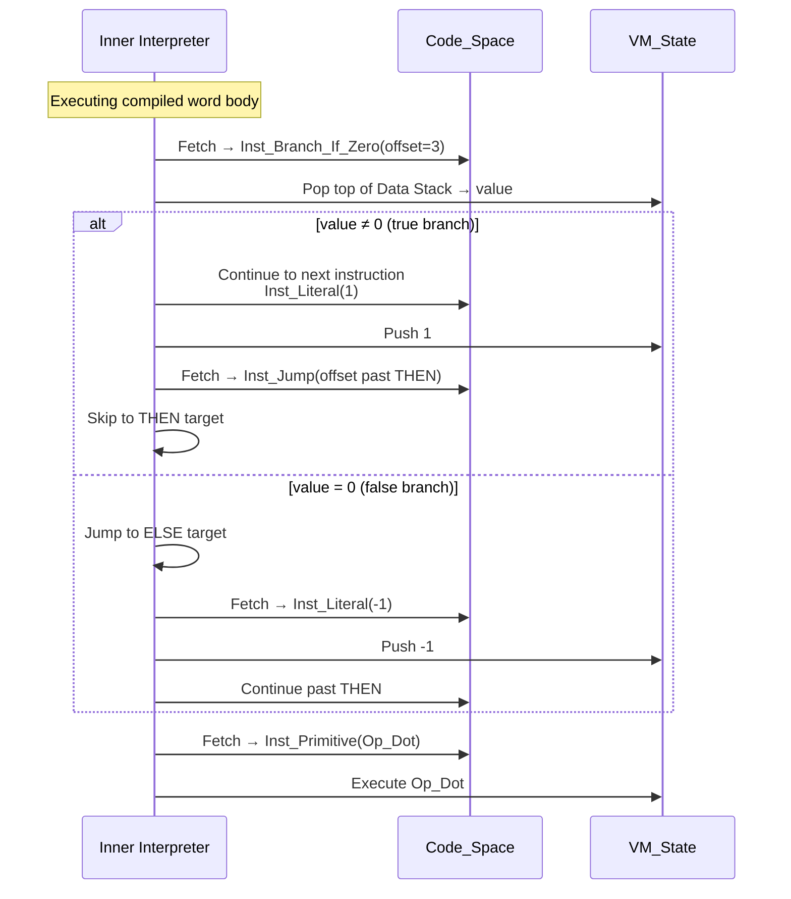

# Design Document: Extended Forth Operations (User-Defined Words, Control Flow, Variables)

## Overview

This document describes the design for extending the existing SPARK-verified Forth interpreter with three major features: user-defined words (colon definitions), conditional control flow (IF/THEN/ELSE), and variables (VARIABLE, `!`, `@`). All new code operates under `SPARK_Mode => On` with zero dynamic memory allocation and formal contracts provable by GNATprove using only the alt-ergo prover.

The existing interpreter has a flat VM_State record with a 256-entry data stack, a 64-entry dictionary of primitive operations, and an outer interpreter loop — all fully verified (186 VCs, zero unproved). The extension preserves this architecture by widening the Dict_Entry record to distinguish primitives from user-defined words, adding a flat instruction array for compiled word bodies, a return stack for nested word execution, a bounded memory array for variables, and a compilation mode for parsing colon definitions and control flow constructs.

The design is structured in three incremental phases matching the priority order: (1) user-defined words, (2) control flow, (3) variables. Each phase extends the VM_State record and the VM_Is_Valid invariant, and each phase is independently provable before proceeding to the next.

## Architecture



### Layer Dependency (Extended)

| Layer | Package | Depends On | Changes |
|-------|---------|------------|---------|
| Foundation | `Bounded_Stacks` | None | Unchanged |
| VM | `Forth_VM` | `Bounded_Stacks` | Extended: new types, new state fields, new ops |
| Interpreter | `Forth_Interpreter` | `Forth_VM` | Extended: compilation mode, inner interpreter |

## Sequence Diagrams

### Colon Definition Compilation: `: SQUARE DUP * ;`

```mermaid
sequenceDiagram
    participant U as Input
    participant I as Interpreter
    participant VM as VM_State
    participant CS as Code_Space

    U->>I: Token ":"
    I->>VM: Enter compilation mode<br/>Compiling := True
    U->>I: Token "SQUARE"
    I->>VM: Record new word name<br/>Current_Name := "SQUARE"
    U->>I: Token "DUP"
    I->>I: Lookup "DUP" → Op_Dup
    I->>CS: Emit Inst_Primitive(Op_Dup)<br/>at Code_Size + 1
    U->>I: Token "*"
    I->>I: Lookup "*" → Op_Mul
    I->>CS: Emit Inst_Primitive(Op_Mul)<br/>at Code_Size + 2
    U->>I: Token ";"
    I->>VM: Create Dict_Entry<br/>Name="SQUARE", Kind=User_Defined<br/>Body_Start=old_Code_Size+1, Body_Len=2
    I->>VM: Exit compilation mode<br/>Compiling := False
    Note over VM: VM_Is_Valid preserved
```

### User-Defined Word Execution: `5 SQUARE .`



### Control Flow: `5 0 > IF 1 ELSE -1 THEN .`




## Components and Interfaces

### Component 1: Extended VM Types (Forth_VM — modified)

**Purpose**: Extend the VM state record with new types for instructions, return stack, code space, variable memory, and compilation state. The Dict_Entry record is widened to distinguish primitives from user-defined words.

**Extended Interface** (Ada / SPARK):
```ada
package Forth_VM
  with SPARK_Mode => On
is
   Stack_Capacity    : constant := 256;
   Return_Capacity   : constant := 64;   --  NEW: nested call depth limit
   Max_Dict_Entries  : constant := 64;
   Max_Word_Length   : constant := 31;
   Max_Code_Size     : constant := 1024; --  NEW: flat instruction array
   Max_Variables     : constant := 64;   --  NEW: variable memory cells

   package Data_Stacks   is new Bounded_Stacks (Max_Depth => Stack_Capacity);
   package Return_Stacks is new Bounded_Stacks (Max_Depth => Return_Capacity);  --  NEW

   subtype Word_Name is String (1 .. Max_Word_Length);

   --  EXTENDED: Primitive_Op gains new operations
   type Primitive_Op is (Op_Add, Op_Sub, Op_Mul,
                         Op_Dup, Op_Drop, Op_Swap,
                         Op_Dot, Op_Noop,
                         Op_Greater, Op_Less, Op_Equal,  --  NEW: comparison ops for IF
                         Op_Store, Op_Fetch);             --  NEW: ! and @

   --  NEW: Instruction type for compiled word bodies
   type Instruction_Kind is (Inst_Primitive,       --  execute a primitive op
                             Inst_Call,            --  call a user-defined word
                             Inst_Literal,         --  push an integer literal
                             Inst_Branch_If_Zero,  --  IF: branch if TOS = 0
                             Inst_Jump,            --  unconditional jump (ELSE→THEN)
                             Inst_Var_Addr,        --  push variable address onto stack
                             Inst_Noop);

   subtype Code_Index is Positive range 1 .. Max_Code_Size;
   subtype Var_Index  is Natural range 0 .. Max_Variables - 1;

   type Instruction is record
      Kind    : Instruction_Kind := Inst_Noop;
      Op      : Primitive_Op     := Op_Noop;      --  for Inst_Primitive
      Operand : Integer          := 0;             --  literal value, jump offset, call target, var addr
   end record;

   type Code_Array is array (Code_Index) of Instruction;
   type Var_Array  is array (Var_Index) of Integer;

   --  EXTENDED: Dict_Entry distinguishes primitives from user-defined words
   type Entry_Kind is (Primitive_Entry, User_Defined_Entry, Variable_Entry);

   type Dict_Entry is record
      Name       : Word_Name       := (others => ' ');
      Length     : Natural range 0 .. Max_Word_Length := 0;
      Kind       : Entry_Kind      := Primitive_Entry;
      Op         : Primitive_Op    := Op_Noop;       --  used when Kind = Primitive_Entry
      Body_Start : Natural         := 0;             --  used when Kind = User_Defined_Entry
      Body_Len   : Natural         := 0;             --  used when Kind = User_Defined_Entry
      Var_Addr   : Var_Index       := 0;             --  used when Kind = Variable_Entry
   end record;

   type Dict_Array is array (1 .. Max_Dict_Entries) of Dict_Entry;

   --  EXTENDED: VM_State with new fields
   type VM_State is record
      Data_Stack   : Data_Stacks.Stack   := Data_Stacks.Empty_Stack;
      Return_Stack : Return_Stacks.Stack := Return_Stacks.Empty_Stack;  --  NEW
      Dictionary   : Dict_Array          := (others => <>);
      Dict_Size    : Natural range 0 .. Max_Dict_Entries := 0;
      Code         : Code_Array          := (others => <>);             --  NEW
      Code_Size    : Natural range 0 .. Max_Code_Size    := 0;          --  NEW
      Memory       : Var_Array           := (others => 0);              --  NEW
      Var_Count    : Natural range 0 .. Max_Variables    := 0;          --  NEW
      Compiling    : Boolean             := False;                      --  NEW
      Comp_Start   : Natural             := 0;                          --  NEW
      Comp_Name    : Word_Name           := (others => ' ');            --  NEW
      Comp_Name_Len: Natural range 0 .. Max_Word_Length := 0;           --  NEW
      Halted       : Boolean             := False;
   end record;

   --  EXTENDED: VM_Is_Valid covers new state
   function VM_Is_Valid (VM : VM_State) return Boolean;

   procedure Initialize (VM : out VM_State)
     with Post => VM_Is_Valid (VM)
                  and then Data_Stacks.Is_Empty (VM.Data_Stack)
                  and then Return_Stacks.Is_Empty (VM.Return_Stack)
                  and then not VM.Compiling;

   --  Existing primitive executors (unchanged signatures)
   --  ... Execute_Add, Execute_Sub, Execute_Mul, Execute_Dup, etc.

   --  NEW: Comparison operators for control flow
   procedure Execute_Greater (VM : in out VM_State)
     with Pre  => VM_Is_Valid (VM)
                  and then Data_Stacks.Size (VM.Data_Stack) >= 2,
          Post => VM_Is_Valid (VM);

   procedure Execute_Less (VM : in out VM_State)
     with Pre  => VM_Is_Valid (VM)
                  and then Data_Stacks.Size (VM.Data_Stack) >= 2,
          Post => VM_Is_Valid (VM);

   procedure Execute_Equal (VM : in out VM_State)
     with Pre  => VM_Is_Valid (VM)
                  and then Data_Stacks.Size (VM.Data_Stack) >= 2,
          Post => VM_Is_Valid (VM);

   --  NEW: Variable operations
   procedure Execute_Store (VM : in out VM_State; Success : out Boolean)
     with Pre  => VM_Is_Valid (VM)
                  and then Data_Stacks.Size (VM.Data_Stack) >= 2,
          Post => VM_Is_Valid (VM);

   procedure Execute_Fetch (VM : in out VM_State; Success : out Boolean)
     with Pre  => VM_Is_Valid (VM)
                  and then not Data_Stacks.Is_Empty (VM.Data_Stack),
          Post => VM_Is_Valid (VM);

   --  NEW: Maximum execution steps for termination guarantee
   Max_Exec_Steps : constant := 10_000;

   --  NEW: Inner interpreter — execute a compiled word body
   procedure Execute_Word
     (VM         : in out VM_State;
      Body_Start : in     Positive;
      Body_Len   : in     Natural;
      Success    :    out Boolean)
     with Pre  => VM_Is_Valid (VM)
                  and then Body_Start >= 1
                  and then Body_Len >= 1
                  and then Body_Start <= Max_Code_Size
                  and then Body_Len <= Max_Code_Size - Body_Start + 1
                  and then Body_Start + Body_Len - 1 <= VM.Code_Size
                  and then Return_Stacks.Is_Empty (VM.Return_Stack),
          Post => VM_Is_Valid (VM)
                  and then Return_Stacks.Is_Empty (VM.Return_Stack);

end Forth_VM;
```

**Responsibilities**:
- Own the complete extended VM state in a single flat record (no pointers, no heap)
- Distinguish primitive, user-defined, and variable dictionary entries via Entry_Kind discriminant
- Store compiled word bodies in a flat Code_Array with start/length indices per dictionary entry
- Provide a return stack for nested word execution (bounded to 64 levels)
- Provide a bounded memory array for variable storage (64 cells)
- Track compilation state (Compiling flag, current word name, compilation start offset)
- Extend VM_Is_Valid to cover all new state fields

### Component 2: Extended Interpreter (Forth_Interpreter — modified)

**Purpose**: Extend the outer interpreter with compilation mode for colon definitions, control flow compilation (IF/ELSE/THEN), and VARIABLE word creation. The dispatch loop branches on the Compiling flag.

**Extended Interface** (Ada / SPARK):
```ada
package Forth_Interpreter
  with SPARK_Mode => On
is
   Max_Line_Length  : constant := 256;
   Max_Token_Length : constant := 31;

   subtype Line_Buffer is String (1 .. Max_Line_Length);

   type Token is record
      Text   : String (1 .. Max_Token_Length) := (others => ' ');
      Length : Natural range 0 .. Max_Token_Length := 0;
   end record;

   --  EXTENDED: new result codes
   type Interpret_Result is (OK, Unknown_Word, Stack_Error,
                             Compile_Error, Halted);  --  NEW: Compile_Error

   procedure Interpret_Line
     (VM   : in out Forth_VM.VM_State;
      Line : in     Line_Buffer;
      Len  : in     Natural;
      Res  :    out Interpret_Result)
     with Pre  => Forth_VM.VM_Is_Valid (VM) and then Len <= Max_Line_Length,
          Post => Forth_VM.VM_Is_Valid (VM);

end Forth_Interpreter;
```

**Responsibilities**:
- When not compiling: dispatch tokens as before (primitives, user-defined words, integer literals)
- When a `:` token is encountered: enter compilation mode, read the next token as the word name
- In compilation mode: compile tokens into the Code_Space as instructions instead of executing them
- Handle `IF`: emit Inst_Branch_If_Zero with a placeholder offset, push current code position onto a compile-time control flow stack (reuse a local variable or the return stack)
- Handle `ELSE`: emit Inst_Jump with placeholder, patch the IF's branch target, push current position
- Handle `THEN`: patch the most recent branch target (from IF or ELSE)
- Handle `;`: finalize the dictionary entry with Body_Start and Body_Len, exit compilation mode
- Handle `VARIABLE`: create a new dictionary entry of kind Variable_Entry, allocate the next memory slot
- When dispatching a User_Defined_Entry: call Execute_Word
- When dispatching a Variable_Entry: push the variable's address onto the data stack
- Maintain VM_Is_Valid loop invariant throughout


## Data Models

### Model 1: Instruction (NEW)

```ada
type Instruction is record
   Kind    : Instruction_Kind := Inst_Noop;
   Op      : Primitive_Op     := Op_Noop;
   Operand : Integer          := 0;
end record;
```

**Validation Rules**:
- When `Kind = Inst_Primitive`: `Op` holds the primitive to execute; `Operand` is unused
- When `Kind = Inst_Call`: `Operand` holds the dictionary index of the word to call
- When `Kind = Inst_Literal`: `Operand` holds the integer value to push
- When `Kind = Inst_Branch_If_Zero`: `Operand` holds the absolute target index in Code_Space to jump to if TOS = 0
- When `Kind = Inst_Jump`: `Operand` holds the absolute target index in Code_Space for unconditional jump
- When `Kind = Inst_Var_Addr`: `Operand` holds the variable address (index into Memory array)
- All instructions at indices `1 .. Code_Size` are considered live

### Model 2: Extended Dict_Entry

```ada
type Dict_Entry is record
   Name       : Word_Name       := (others => ' ');
   Length     : Natural range 0 .. Max_Word_Length := 0;
   Kind       : Entry_Kind      := Primitive_Entry;
   Op         : Primitive_Op    := Op_Noop;
   Body_Start : Natural         := 0;
   Body_Len   : Natural         := 0;
   Var_Addr   : Var_Index       := 0;
end record;
```

**Validation Rules**:
- `Length > 0` for all active entries (indices `1 .. Dict_Size`)
- When `Kind = Primitive_Entry`: `Op /= Op_Noop`
- When `Kind = User_Defined_Entry`: `Body_Start >= 1` and `Body_Start + Body_Len - 1 <= Code_Size` and `Body_Len >= 1`
- When `Kind = Variable_Entry`: `Var_Addr < Var_Count`

### Model 3: Extended VM_State

```ada
type VM_State is record
   Data_Stack    : Data_Stacks.Stack;
   Return_Stack  : Return_Stacks.Stack;    --  NEW
   Dictionary    : Dict_Array;
   Dict_Size     : Natural range 0 .. Max_Dict_Entries;
   Code          : Code_Array;              --  NEW
   Code_Size     : Natural range 0 .. Max_Code_Size;  --  NEW
   Memory        : Var_Array;               --  NEW
   Var_Count     : Natural range 0 .. Max_Variables;   --  NEW
   Compiling     : Boolean;                 --  NEW
   Comp_Start    : Natural;                 --  NEW
   Comp_Name     : Word_Name;              --  NEW
   Comp_Name_Len : Natural range 0 .. Max_Word_Length; --  NEW
   Halted        : Boolean;
end record;
```

**Extended VM_Is_Valid Rules**:
- `Dict_Size` in `0 .. Max_Dict_Entries`
- All active dictionary entries at indices `1 .. Dict_Size` have `Length > 0`
- `Code_Size` in `0 .. Max_Code_Size`
- `Var_Count` in `0 .. Max_Variables`
- For each user-defined entry at index `I` in `1 .. Dict_Size`: `Body_Start >= 1` and `Body_Start + Body_Len - 1 <= Code_Size`
- When `Compiling = True`: `Comp_Start` in `0 .. Code_Size` and `Comp_Name_Len > 0`
- The return stack is empty when not inside Execute_Word (enforced by Execute_Word's contract, not by VM_Is_Valid directly)

### Model 4: Code_Space Layout

The Code_Space is a flat array of instructions. Each user-defined word occupies a contiguous slice:

```
Code_Space:
  [1]  Inst_Primitive(Op_Dup)     ← SQUARE body start
  [2]  Inst_Primitive(Op_Mul)     ← SQUARE body end
  [3]  Inst_Literal(5)            ← DOUBLE body start
  [4]  Inst_Primitive(Op_Add)
  [5]  Inst_Primitive(Op_Add)     ← DOUBLE body end
  [6]  Inst_Branch_If_Zero(9)     ← ABS body start (IF)
  [7]  Inst_Literal(0)
  [8]  Inst_Jump(10)              ← (ELSE jump)
  [9]  Inst_Literal(1)            ← (ELSE target)
  [10] ...                        ← (THEN target)
  ...
  [Code_Size] last used slot
  [Code_Size+1 .. Max_Code_Size] unused
```

Dictionary entries reference into this array:
- SQUARE: `Body_Start = 1, Body_Len = 2`
- DOUBLE: `Body_Start = 3, Body_Len = 3`

## Key Functions with Formal Specifications

### Function 1: Execute_Word (NEW — Inner Interpreter)

```ada
procedure Execute_Word
  (VM         : in out VM_State;
   Body_Start : in     Positive;
   Body_Len   : in     Natural;
   Success    :    out Boolean)
  with Pre  => VM_Is_Valid (VM)
               and then Body_Start >= 1
               and then Body_Len >= 1
               and then Body_Start <= Max_Code_Size
               and then Body_Len <= Max_Code_Size - Body_Start + 1
               and then Body_Start + Body_Len - 1 <= VM.Code_Size
               and then Return_Stacks.Is_Empty (VM.Return_Stack),
       Post => VM_Is_Valid (VM)
               and then Return_Stacks.Is_Empty (VM.Return_Stack);
```

**Preconditions:**
- VM is in a valid state
- `Body_Start` and `Body_Len` define a valid slice within the live Code_Space (`1 .. Code_Size`)
- `Body_Len >= 1` (no empty word bodies)
- Return stack is empty (Execute_Word is the top-level entry point for word execution; nested calls are handled internally via the return stack, not via Ada-level recursion)

**Postconditions:**
- VM remains in a valid state regardless of success or failure
- Return stack is empty (all frames pushed during execution have been popped — either by normal returns or by the error-path drain loop)
- `Success = True` if all instructions executed without error
- `Success = False` if a stack error, invalid jump target, nesting overflow, or fuel exhaustion occurred

**Loop Invariants (instruction fetch loop):**
```ada
pragma Loop_Invariant (VM_Is_Valid (VM));
pragma Loop_Invariant (PC >= 1 and then PC <= Max_Code_Size + 1);
pragma Loop_Invariant (End_Addr >= 1 and then End_Addr <= Max_Code_Size + 1);
pragma Loop_Invariant (Steps <= Max_Exec_Steps);
```
- `VM_Is_Valid(VM)` holds at every iteration boundary
- `PC` and `End_Addr` stay within the addressable code range
- `Steps` is bounded by `Max_Exec_Steps`, providing the termination measure for the prover (the loop exits when `Steps >= Max_Exec_Steps`)

### Function 2: Emit_Instruction (NEW — Compilation Helper)

```ada
procedure Emit_Instruction
  (VM   : in out VM_State;
   Inst : in     Instruction;
   OK   :    out Boolean)
  with Pre  => VM_Is_Valid (VM) and then VM.Compiling,
       Post => VM_Is_Valid (VM);
```

**Preconditions:**
- VM is valid and in compilation mode

**Postconditions:**
- VM remains valid
- `OK = True` if Code_Size < Max_Code_Size (instruction was emitted)
- `OK = False` if Code_Space is full (no instruction emitted)

**Loop Invariants:** N/A (no loops)

### Function 3: Finalize_Definition (NEW — End of Colon Definition)

```ada
procedure Finalize_Definition
  (VM  : in out VM_State;
   OK  :    out Boolean)
  with Pre  => VM_Is_Valid (VM)
               and then VM.Compiling
               and then VM.Comp_Name_Len > 0,
       Post => VM_Is_Valid (VM)
               and then not VM.Compiling;
```

**Preconditions:**
- VM is valid and in compilation mode
- A word name has been recorded (`Comp_Name_Len > 0`)

**Postconditions:**
- VM is valid and no longer in compilation mode
- `OK = True` if the dictionary had room for the new entry
- `OK = False` if the dictionary was full (definition discarded, Code_Size rolled back)

**Loop Invariants:** N/A (no loops)

### Function 4: Execute_Greater (NEW — Comparison for IF)

```ada
procedure Execute_Greater (VM : in out VM_State)
  with Pre  => VM_Is_Valid (VM)
               and then Data_Stacks.Size (VM.Data_Stack) >= 2,
       Post => VM_Is_Valid (VM);
```

**Preconditions:**
- VM is valid, data stack has at least 2 elements

**Postconditions:**
- VM remains valid
- Pops two values (A then B), pushes -1 (true) if B > A, else pushes 0 (false)
- Net stack effect: -1 (two popped, one pushed)

**Loop Invariants:** N/A

### Function 5: Execute_Store (NEW — Variable Store `!`)

```ada
procedure Execute_Store (VM : in out VM_State; Success : out Boolean)
  with Pre  => VM_Is_Valid (VM)
               and then Data_Stacks.Size (VM.Data_Stack) >= 2,
       Post => VM_Is_Valid (VM);
```

**Preconditions:**
- VM is valid, data stack has at least 2 elements (value and address)

**Postconditions:**
- VM remains valid
- Pops address (TOS) and value (NOS)
- If address is in `0 .. Var_Count - 1`: stores value in `Memory(address)`, `Success := True`
- If address is out of range: restores stack, `Success := False`

**Loop Invariants:** N/A

### Function 6: Execute_Fetch (NEW — Variable Fetch `@`)

```ada
procedure Execute_Fetch (VM : in out VM_State; Success : out Boolean)
  with Pre  => VM_Is_Valid (VM)
               and then not Data_Stacks.Is_Empty (VM.Data_Stack),
       Post => VM_Is_Valid (VM);
```

**Preconditions:**
- VM is valid, data stack is not empty (address on top)

**Postconditions:**
- VM remains valid
- Pops address (TOS)
- If address is in `0 .. Var_Count - 1`: pushes `Memory(address)`, `Success := True`
- If address is out of range: restores stack, `Success := False`

**Loop Invariants:** N/A


## Algorithmic Pseudocode

### Extended Dict_Entries_Valid

The existing `Dict_Entries_Valid` unrolls the first 7 entries explicitly for alt-ergo. The extended version must also validate user-defined entries' code references. However, since alt-ergo struggles with quantified predicates over record fields, we keep the unrolled structure for the first N built-in entries and use a simpler length-only check:

```ada
function Dict_Entries_Valid (D : Dict_Array; N : Natural) return Boolean is
  (N = 0
   or else (N >= 1 and then D (1).Length > 0
            and then (N < 2 or else (D (2).Length > 0
            and then (N < 3 or else (D (3).Length > 0
            --  ... unroll through entry 10 (7 original + 3 new: >, <, =)
            and then (N < 11
                      or else (for all I in 11 .. N =>
                                 D (I).Length > 0))))))))))))))))))))
  with Pre => N <= Max_Dict_Entries;
```

The key insight: we only need `Length > 0` in the validity predicate. The structural validity of user-defined entries (Body_Start/Body_Len within Code_Size) is checked at definition time and maintained as a separate invariant or checked at call time in Execute_Word's precondition.

### Interpret_Line — Extended with Compilation Mode

```ada
procedure Interpret_Line
  (VM : in out VM_State; Line : in Line_Buffer;
   Len : in Natural; Res : out Interpret_Result)
is
   Pos : Natural := 1;
   Tok : Token;
begin
   Res := OK;
   if Len = 0 then return; end if;

   while Pos <= Len and then Res = OK loop
      pragma Loop_Invariant (VM_Is_Valid (VM));
      pragma Loop_Invariant (Pos in 1 .. Len + 1);
      pragma Loop_Invariant (Res = OK);

      Skip_Spaces (Line, Len, Pos);
      exit when Pos > Len;
      Read_Token (Line, Len, Pos, Tok);

      if VM.Compiling then
         --  COMPILATION MODE
         if Token_Equals (Tok, ";") then
            --  End of colon definition
            Finalize_Definition (VM, OK => ...);
            if not OK then Res := Compile_Error; end if;

         elsif Token_Equals (Tok, "IF") then
            --  Emit Branch_If_Zero with placeholder target
            Emit_Instruction (VM,
              (Kind => Inst_Branch_If_Zero, Operand => 0, others => <>),
              OK => ...);
            --  Push current Code_Size onto control flow stack
            --  (use a local array, not the return stack)
            CF_Push (CF_Stack, CF_Top, VM.Code_Size);

         elsif Token_Equals (Tok, "ELSE") then
            --  Emit unconditional Jump with placeholder
            Emit_Instruction (VM,
              (Kind => Inst_Jump, Operand => 0, others => <>),
              OK => ...);
            --  Patch the IF's Branch_If_Zero target to Code_Size + 1
            IF_Addr := CF_Pop (CF_Stack, CF_Top);
            VM.Code (IF_Addr).Operand := VM.Code_Size + 1;
            --  Push current Code_Size for THEN to patch
            CF_Push (CF_Stack, CF_Top, VM.Code_Size);

         elsif Token_Equals (Tok, "THEN") then
            --  Patch the most recent branch target
            Branch_Addr := CF_Pop (CF_Stack, CF_Top);
            VM.Code (Branch_Addr).Operand := VM.Code_Size + 1;

         else
            --  Compile the token as an instruction
            Compile_Token (VM, Tok, OK => ...);
            if not OK then Res := Compile_Error; end if;
         end if;

      else
         --  INTERPRETATION MODE (extended from existing)
         if Token_Equals (Tok, ":") then
            --  Enter compilation mode
            Skip_Spaces (Line, Len, Pos);
            exit when Pos > Len;  -- missing name
            Read_Token (Line, Len, Pos, Tok);
            VM.Compiling := True;
            VM.Comp_Start := VM.Code_Size;
            VM.Comp_Name (1 .. Tok.Length) := Tok.Text (1 .. Tok.Length);
            VM.Comp_Name_Len := Tok.Length;

         elsif Token_Equals (Tok, "VARIABLE") then
            --  Create a new variable
            Skip_Spaces (Line, Len, Pos);
            exit when Pos > Len;
            Read_Token (Line, Len, Pos, Tok);
            Create_Variable (VM, Tok, OK => ...);
            if not OK then Res := Compile_Error; end if;

         else
            --  Existing dispatch: lookup, execute primitive/user-defined/variable, or parse integer
            Lookup (VM.Dictionary, VM.Dict_Size, Tok, Found, Entry_Idx);
            if Found then
               case VM.Dictionary (Entry_Idx).Kind is
                  when Primitive_Entry =>
                     Dispatch_Primitive (VM, VM.Dictionary (Entry_Idx).Op, Success);
                  when User_Defined_Entry =>
                     Execute_Word (VM,
                       VM.Dictionary (Entry_Idx).Body_Start,
                       VM.Dictionary (Entry_Idx).Body_Len,
                       Success);
                  when Variable_Entry =>
                     --  Push the variable's address onto the data stack
                     if not Data_Stacks.Is_Full (VM.Data_Stack) then
                        Data_Stacks.Push (VM.Data_Stack,
                          Integer (VM.Dictionary (Entry_Idx).Var_Addr));
                        Success := True;
                     else
                        Success := False;
                     end if;
               end case;
               if not Success then Res := Stack_Error; end if;
            else
               --  Try integer literal (unchanged)
               Try_Parse_Integer (Tok, Value, Parsed);
               ...
            end if;
         end if;
      end if;
   end loop;
end Interpret_Line;
```

### Compile_Token — Compile a Single Token into Code_Space

```ada
procedure Compile_Token
  (VM  : in out VM_State;
   Tok : in     Token;
   OK  :    out Boolean)
  with Pre  => VM_Is_Valid (VM) and then VM.Compiling,
       Post => VM_Is_Valid (VM)
is
   Found     : Boolean;
   Entry_Idx : Natural;
   Value     : Integer;
   Parsed    : Boolean;
begin
   OK := True;
   Lookup (VM.Dictionary, VM.Dict_Size, Tok, Found, Entry_Idx);

   if Found then
      case VM.Dictionary (Entry_Idx).Kind is
         when Primitive_Entry =>
            Emit_Instruction (VM,
              (Kind => Inst_Primitive,
               Op   => VM.Dictionary (Entry_Idx).Op,
               Operand => 0),
              OK);
         when User_Defined_Entry =>
            Emit_Instruction (VM,
              (Kind    => Inst_Call,
               Op      => Op_Noop,
               Operand => Entry_Idx),
              OK);
         when Variable_Entry =>
            Emit_Instruction (VM,
              (Kind    => Inst_Var_Addr,
               Op      => Op_Noop,
               Operand => Integer (VM.Dictionary (Entry_Idx).Var_Addr)),
              OK);
      end case;
   else
      Try_Parse_Integer (Tok, Value, Parsed);
      if Parsed then
         Emit_Instruction (VM,
           (Kind    => Inst_Literal,
            Op      => Op_Noop,
            Operand => Value),
           OK);
      else
         OK := False;  -- unknown word during compilation
      end if;
   end if;
end Compile_Token;
```

### Execute_Word — Inner Interpreter

See the **Recursion Model** section above for the definitive iterative pseudocode of `Execute_Word`, including the fuel counter, return stack frame management, and error-path drain loop.

### Recursion Model

#### Design Decision: Iterative Inner Interpreter with Explicit Return Stack

SPARK 2014 requires a termination proof for every recursive subprogram call. Providing such a proof for `Execute_Word` calling itself would require a `Subprogram_Variant` annotation with a decreasing measure — but there is no natural decreasing measure for Forth word execution (a word can call any other word, including itself, and the call graph is determined at runtime by dictionary contents). Therefore, **Execute_Word MUST be implemented as a single iterative loop** that manages call/return context explicitly via the return stack. No Ada-level recursion occurs.

#### Self-Recursive and Mutually Recursive Words Are Permitted

Forth traditionally allows words to call themselves:
```
: COUNTDOWN DUP 0 > IF DUP . 1 - COUNTDOWN THEN ;
```

This is supported. When `Inst_Call` references the word currently being executed (or any other user-defined word), the iterative interpreter simply pushes the current return context onto the return stack and jumps to the callee's body. There is no special-casing for self-calls vs. cross-calls — the mechanism is identical.

#### Termination Guarantee: Return Stack Depth Bound

Since there is no Ada-level recursion, SPARK does not require a `Subprogram_Variant`. Instead, termination of the `Execute_Word` loop is guaranteed by a **fuel-based approach**: the loop tracks total instructions executed and aborts when a configurable maximum is reached.

This is necessary because Forth's control flow (branches + calls) can create cycles within the instruction stream. A word like `: LOOP-FOREVER 1 LOOP-FOREVER ;` would loop indefinitely without a bound. The return stack alone is not sufficient — a self-recursive word that tail-calls itself could consume zero net return stack entries if the compiler were to optimize, and even without optimization, a word can loop via backward branches within its own body.

The design uses two complementary bounds:

1. **Return stack depth** (existing: `Return_Capacity = 64`): Each `Inst_Call` pushes 2 entries (return PC + return End_Addr). When the return stack is full (32 nested calls deep), further calls fail with `Success := False`. This bounds nesting depth.

2. **Maximum instruction count** (new: `Max_Exec_Steps`): A counter tracks total instructions executed across all nesting levels within a single `Execute_Word` invocation. When the counter reaches `Max_Exec_Steps`, execution aborts with `Success := False`. This bounds total work and catches infinite loops from backward branches or unbounded recursion that stays within the return stack limit.

```ada
Max_Exec_Steps : constant := 10_000;
```

#### Return Stack Frame Layout

Each `Inst_Call` pushes exactly 2 values onto the return stack:

```
Return Stack (grows upward):
  [Top]     End_Addr of caller   (Integer encoding of the one-past-end address)
  [Top - 1] Return_PC of caller  (Integer encoding of PC + 1, the instruction after the call)
  ...       (previous frames)
```

On reaching the end of a callee's body (`PC >= End_Addr`), the interpreter checks whether the return stack is non-empty. If so, it pops the saved `End_Addr` and `Return_PC`, restoring the caller's execution context. If the return stack is empty, the top-level word has completed.

Since each frame is exactly 2 entries and `Return_Capacity = 64`, the maximum nesting depth is 32 levels. This is checked before each push: if `Return_Stacks.Size(VM.Return_Stack) > Return_Capacity - 2`, the call fails.

#### Loop Invariant for the Iterative Inner Interpreter

The loop invariant must establish:
1. `VM_Is_Valid(VM)` — the fundamental state invariant
2. `PC >= 1 and then PC <= Max_Code_Size + 1` — PC is within addressable range (may equal End_Addr when about to return)
3. `End_Addr >= 1 and then End_Addr <= Max_Code_Size + 1` — current word boundary is valid
4. `Steps <= Max_Exec_Steps` — fuel counter is within bounds
5. `Return_Stacks.Size(VM.Return_Stack) mod 2 = 0` — return stack always contains paired frames (optional, aids reasoning)

The loop terminates when any of:
- `PC >= End_Addr` and the return stack is empty (normal completion)
- `Success = False` (error)
- `Steps >= Max_Exec_Steps` (fuel exhausted)

#### Pseudocode: Iterative Execute_Word (Definitive Version)

```ada
procedure Execute_Word
  (VM         : in out VM_State;
   Body_Start : in     Positive;
   Body_Len   : in     Natural;
   Success    :    out Boolean)
is
   PC       : Natural := Body_Start;
   End_Addr : Natural := Body_Start + Body_Len;
   Steps    : Natural := 0;
   Inst     : Instruction;
   Op_OK    : Boolean;
begin
   Success := True;

   while Success loop
      pragma Loop_Invariant (VM_Is_Valid (VM));
      pragma Loop_Invariant (PC >= 1 and then PC <= Max_Code_Size + 1);
      pragma Loop_Invariant (End_Addr >= 1 and then End_Addr <= Max_Code_Size + 1);
      pragma Loop_Invariant (Steps <= Max_Exec_Steps);

      --  Check for return from completed word body
      while PC >= End_Addr
        and then not Return_Stacks.Is_Empty (VM.Return_Stack)
      loop
         pragma Loop_Invariant (VM_Is_Valid (VM));
         pragma Loop_Invariant (Return_Stacks.Size (VM.Return_Stack) >= 2);
         declare
            Saved_End, Saved_PC : Integer;
         begin
            Return_Stacks.Pop (VM.Return_Stack, Saved_End);
            Return_Stacks.Pop (VM.Return_Stack, Saved_PC);
            if Saved_PC >= 1 and then Saved_PC <= Max_Code_Size + 1
              and then Saved_End >= 1 and then Saved_End <= Max_Code_Size + 1
            then
               PC := Saved_PC;
               End_Addr := Saved_End;
            else
               Success := False;
               exit;
            end if;
         end;
      end loop;

      --  Exit if top-level word completed or error
      exit when not Success;
      exit when PC >= End_Addr and then Return_Stacks.Is_Empty (VM.Return_Stack);

      --  Fuel check
      if Steps >= Max_Exec_Steps then
         Success := False;
         exit;
      end if;
      Steps := Steps + 1;

      --  Fetch and execute current instruction
      Inst := VM.Code (PC);

      case Inst.Kind is
         when Inst_Call =>
            if Inst.Operand in 1 .. VM.Dict_Size
              and then VM.Dictionary (Inst.Operand).Kind = User_Defined_Entry
              and then VM.Dictionary (Inst.Operand).Body_Start >= 1
              and then VM.Dictionary (Inst.Operand).Body_Len >= 1
              and then VM.Dictionary (Inst.Operand).Body_Start
                       + VM.Dictionary (Inst.Operand).Body_Len - 1 <= VM.Code_Size
              and then Return_Stacks.Size (VM.Return_Stack) <= Return_Capacity - 2
            then
               --  Push return context (2 entries)
               Return_Stacks.Push (VM.Return_Stack, PC + 1);
               Return_Stacks.Push (VM.Return_Stack, End_Addr);
               --  Enter callee
               End_Addr := VM.Dictionary (Inst.Operand).Body_Start
                         + VM.Dictionary (Inst.Operand).Body_Len;
               PC := VM.Dictionary (Inst.Operand).Body_Start;
            else
               Success := False;
            end if;

         when Inst_Primitive =>
            Dispatch_Primitive (VM, Inst.Op, Op_OK);
            if not Op_OK then Success := False; end if;
            PC := PC + 1;

         when Inst_Literal =>
            if not Data_Stacks.Is_Full (VM.Data_Stack) then
               Data_Stacks.Push (VM.Data_Stack, Inst.Operand);
            else
               Success := False;
            end if;
            PC := PC + 1;

         when Inst_Branch_If_Zero =>
            if not Data_Stacks.Is_Empty (VM.Data_Stack) then
               declare
                  V : Integer;
               begin
                  Data_Stacks.Pop (VM.Data_Stack, V);
                  if V = 0 then
                     if Inst.Operand in Body_Start .. End_Addr then
                        PC := Inst.Operand;
                     else
                        Success := False;
                     end if;
                  else
                     PC := PC + 1;
                  end if;
               end;
            else
               Success := False;
            end if;

         when Inst_Jump =>
            if Inst.Operand in Body_Start .. End_Addr then
               PC := Inst.Operand;
            else
               Success := False;
            end if;

         when Inst_Var_Addr =>
            if not Data_Stacks.Is_Full (VM.Data_Stack) then
               Data_Stacks.Push (VM.Data_Stack, Inst.Operand);
            else
               Success := False;
            end if;
            PC := PC + 1;

         when Inst_Noop =>
            PC := PC + 1;
      end case;
   end loop;

   --  On error, drain the return stack to restore balance
   if not Success then
      while not Return_Stacks.Is_Empty (VM.Return_Stack) loop
         pragma Loop_Invariant (VM_Is_Valid (VM));
         declare
            Discard : Integer;
         begin
            Return_Stacks.Pop (VM.Return_Stack, Discard);
         end;
      end loop;
   end if;
end Execute_Word;
```

#### Key Design Rationale

- **Why not SPARK recursion?** SPARK requires `Subprogram_Variant` with a provably decreasing measure. No such measure exists for arbitrary Forth call graphs — the callee is determined by a runtime dictionary index, and self-recursion is legal. The iterative approach sidesteps this entirely.
- **Why fuel + return stack depth, not just one?** Return stack depth alone doesn't catch infinite loops within a single word body (backward branches via IF/THEN patterns or future loop constructs). Fuel alone doesn't give a meaningful nesting limit. Together they provide both a call-depth bound (32 levels) and a total-work bound (10,000 instructions).
- **Why drain the return stack on error?** The postcondition `VM_Is_Valid(VM)` must hold on all exit paths. If we abort mid-execution with frames on the return stack, the caller (Interpret_Line) would see a non-empty return stack. Draining it ensures the return stack is empty when Execute_Word returns, matching the precondition expectation for the next call. This also satisfies Property 9 (return stack balance).
- **Why 10,000 steps?** This is a pragmatic default. It's large enough for any reasonable Forth program (a 1024-instruction code space with moderate nesting) but small enough to prevent the REPL from hanging. It can be made configurable via a constant.

### Create_Variable — Allocate a Named Variable

```ada
procedure Create_Variable
  (VM  : in out VM_State;
   Tok : in     Token;
   OK  :    out Boolean)
  with Pre  => VM_Is_Valid (VM) and then not VM.Compiling
               and then Tok.Length >= 1,
       Post => VM_Is_Valid (VM)
is
begin
   if VM.Dict_Size >= Max_Dict_Entries or else VM.Var_Count >= Max_Variables then
      OK := False;
      return;
   end if;

   VM.Dict_Size := VM.Dict_Size + 1;
   VM.Dictionary (VM.Dict_Size) :=
     (Name       => (others => ' '),
      Length     => Tok.Length,
      Kind       => Variable_Entry,
      Op         => Op_Noop,
      Body_Start => 0,
      Body_Len   => 0,
      Var_Addr   => VM.Var_Count);
   VM.Dictionary (VM.Dict_Size).Name (1 .. Tok.Length) :=
     Tok.Text (1 .. Tok.Length);
   VM.Memory (VM.Var_Count) := 0;  -- initialize to zero
   VM.Var_Count := VM.Var_Count + 1;
   OK := True;
end Create_Variable;
```


## Example Usage

### User-Defined Words

```
> : SQUARE DUP * ;
 OK
> 5 SQUARE .
 25  OK
> : CUBE DUP SQUARE * ;
 OK
> 3 CUBE .
 27  OK
```

Execution trace for `5 SQUARE .`:
1. Push 5 → stack: [5]
2. Lookup SQUARE → User_Defined_Entry, Body_Start=1, Body_Len=2
3. Execute_Word: PC=1, Inst_Primitive(Op_Dup) → stack: [5, 5]
4. Execute_Word: PC=2, Inst_Primitive(Op_Mul) → stack: [25]
5. Execute_Word returns
6. `.` → pop and print 25 → stack: []

### Control Flow (IF/ELSE/THEN)

```
> : ABS DUP 0 < IF -1 * THEN ;
 OK
> -5 ABS .
 5  OK
> 5 ABS .
 5  OK
> : MAX 2DUP > IF DROP ELSE SWAP DROP THEN ;
```

Compiled code for `: ABS DUP 0 < IF -1 * THEN ;`:
```
Code[1]: Inst_Primitive(Op_Dup)
Code[2]: Inst_Literal(0)
Code[3]: Inst_Primitive(Op_Less)
Code[4]: Inst_Branch_If_Zero(7)    ← IF: skip to THEN if false
Code[5]: Inst_Literal(-1)
Code[6]: Inst_Primitive(Op_Mul)
Code[7]: (next word starts here)   ← THEN target
```
Body_Start=1, Body_Len=6

### Variables

```
> VARIABLE X
 OK
> 42 X !
 OK
> X @  .
 42  OK
> X @ 1 + X !
 OK
> X @ .
 43  OK
```

Execution trace for `42 X !`:
1. Push 42 → stack: [42]
2. Lookup X → Variable_Entry, Var_Addr=0
3. Push address 0 → stack: [42, 0]
4. `!` (Execute_Store): pop address 0, pop value 42, Memory(0) := 42 → stack: []

Execution trace for `X @ .`:
1. Lookup X → Variable_Entry, Var_Addr=0
2. Push address 0 → stack: [0]
3. `@` (Execute_Fetch): pop address 0, push Memory(0) = 42 → stack: [42]
4. `.` → pop and print 42 → stack: []

## Correctness Properties

*A property is a characteristic or behavior that should hold true across all valid executions of a system — essentially, a formal statement about what the system should do. Properties serve as the bridge between human-readable specifications and machine-verifiable correctness guarantees.*

### Property 1: VM_Is_Valid Preservation Under All New Operations

*For any* valid VM_State and *for any* new operation (Execute_Greater, Execute_Less, Execute_Equal, Execute_Store, Execute_Fetch, Execute_Word, Emit_Instruction, Finalize_Definition, Create_Variable) where the preconditions are met, the resulting VM_State shall satisfy VM_Is_Valid.

**Validates: Requirements 3.1, 3.2, 3.3, 3.4, 6.3, 7.3, 8.5, 12.4, 15.5**

### Property 2: Colon Definition Round Trip

*For any* valid VM_State in interpretation mode with room in the dictionary and code space, entering compilation mode with `:`, compiling a sequence of valid tokens, and finalizing with `;` shall produce a VM_State where: (a) Compiling = False, (b) Dict_Size = Dict_Size'Old + 1, (c) the new dictionary entry has Kind = User_Defined_Entry with Body_Start and Body_Len referencing a valid slice of Code_Space, and (d) VM_Is_Valid holds.

**Validates: Requirements 2.2, 5.1, 5.3, 5.4, 7.1**

### Property 3: Execute_Word Terminates and Preserves Postconditions

*For any* valid VM_State and *for any* valid word body, Execute_Word shall terminate in at most Max_Exec_Steps iterations of the main loop, returning with VM_Is_Valid preserved and the Return_Stack empty. Termination is guaranteed by a fuel counter that increments toward Max_Exec_Steps regardless of control flow (branches, calls, self-recursion). When fuel is exhausted, Execute_Word sets Success := False, drains the Return_Stack, and returns.

*For any* word body containing no Inst_Call or backward-branch instructions, Execute_Word shall terminate in at most Body_Len iterations. *For any* word body containing Inst_Call instructions, nesting depth is additionally bounded by Return_Capacity / 2 (each call frame is 2 entries).

**Validates: Requirements 8.1, 8.5, 9.1, 9.2, 9.3, 11.1, 11.2**

### Property 4: Branch Target Validity

*For any* colon definition containing IF/THEN or IF/ELSE/THEN, the compiled Inst_Branch_If_Zero and Inst_Jump instructions shall have Operand values within `Body_Start .. Body_Start + Body_Len` (inclusive of the one-past-end position for THEN at the end of a body). For IF/THEN without ELSE, only Inst_Branch_If_Zero is emitted (no Inst_Jump), with the target pointing past the THEN position.

**Validates: Requirements 13.1, 13.2, 13.3, 13.4**

### Property 5: Variable Address Uniqueness

*For any* sequence of VARIABLE declarations on a valid VM_State, each created variable shall receive a distinct Var_Addr value, and Var_Addr values shall be contiguous starting from 0. The Var_Addr of the Nth variable created equals N - 1.

**Validates: Requirements 2.3, 14.1**

### Property 6: Store-Fetch Round Trip

*For any* valid VM_State with at least one variable allocated, *for any* value V and *for any* valid address A (in 0 .. Var_Count - 1), storing V at address A and then fetching from address A shall yield V, provided no intervening store to address A occurs.

**Validates: Requirements 15.1, 15.3**

### Property 7: Comparison Operators Produce Forth Boolean

*For any* valid VM_State with at least 2 elements on the data stack and *for any* two integer values A and B, Execute_Greater, Execute_Less, and Execute_Equal shall each pop two values and push either -1 (true) or 0 (false) according to the comparison result, with a net stack effect of minus one (two popped, one pushed).

**Validates: Requirements 12.1, 12.2, 12.3, 12.4**

### Property 8: Compilation Mode Isolation

*For any* valid VM_State in compilation mode and *for any* sequence of valid tokens (excluding `;`), the Data_Stack and Memory contents are unchanged after compilation. Only Code_Size and Code contents change.

**Validates: Requirements 5.2, 16.3**

### Property 9: Return Stack Balance Across Word Calls

*For any* valid VM_State with an empty Return_Stack, after Execute_Word completes (successfully or not), the Return_Stack shall be empty. Each Inst_Call pushes exactly 2 entries and each return pops exactly 2 entries, maintaining paired frames throughout execution.

**Validates: Requirements 8.5, 10.1, 10.2, 11.1, 11.2**

### Property 10: Token Compilation Correctness

*For any* valid token encountered during compilation mode: (a) a known primitive word produces an Inst_Primitive instruction with the correct Op, (b) a known user-defined word produces an Inst_Call instruction with the correct dictionary index, (c) a valid integer literal produces an Inst_Literal instruction with the parsed value, and (d) a known variable produces an Inst_Var_Addr instruction with the correct address.

**Validates: Requirements 5.5, 5.6, 5.7**

### Property 11: Existing Primitives Unaffected

*For any* valid VM_State, the behavior of the 7 original primitive operations (+, -, *, DUP, DROP, SWAP, .) shall be identical to the pre-extension behavior. The extended Dict_Entry record and new Entry_Kind field shall not alter primitive dispatch.

**Validates: Requirements 19.1, 19.2**

### Property 12: Code_Space Monotonic Growth

*For any* sequence of successful colon definitions, Code_Size is monotonically non-decreasing. A failed definition (e.g., dictionary full) rolls back Code_Size to Comp_Start, but a successful definition always increases Code_Size by at least 1.

**Validates: Requirements 6.1, 7.1, 7.2**

## Error Handling

### Error Scenario 1: Code Space Overflow

**Condition**: During compilation, Code_Size reaches Max_Code_Size and another instruction needs to be emitted
**Response**: `Emit_Instruction` returns `OK := False`, `Interpret_Line` returns `Compile_Error`
**Recovery**: The partially compiled definition is abandoned. Code_Size is rolled back to Comp_Start. Compiling is set to False. VM_Is_Valid is preserved.

### Error Scenario 2: Dictionary Full on Colon Definition

**Condition**: `;` is encountered but Dict_Size = Max_Dict_Entries
**Response**: `Finalize_Definition` returns `OK := False`, Code_Size is rolled back to Comp_Start
**Recovery**: The compiled instructions are effectively discarded. VM state is consistent.

### Error Scenario 3: Missing Word Name After `:`

**Condition**: `:` is the last token on the line (no name follows)
**Response**: `Interpret_Line` exits the loop without entering compilation mode, returns `Compile_Error`
**Recovery**: VM state unchanged.

### Error Scenario 4: Return Stack Overflow (Nested Calls Too Deep)

**Condition**: Execute_Word encounters Inst_Call but `Return_Stacks.Size(VM.Return_Stack) > Return_Capacity - 2` (not enough room for a 2-entry frame)
**Response**: `Execute_Word` sets `Success := False`, drains the return stack, and returns
**Recovery**: VM_Is_Valid preserved, return stack empty. The outer interpreter reports Stack_Error.

### Error Scenario 4a: Execution Fuel Exhausted

**Condition**: The instruction step counter in Execute_Word reaches `Max_Exec_Steps` (10,000)
**Response**: `Execute_Word` sets `Success := False`, drains the return stack, and returns
**Recovery**: VM_Is_Valid preserved, return stack empty. This catches infinite recursion (`: X X ;`) and infinite loops from backward branches. The outer interpreter reports Stack_Error.

### Error Scenario 5: Invalid Variable Address on Store/Fetch

**Condition**: `!` or `@` is called with an address not in `0 .. Var_Count - 1`
**Response**: Execute_Store/Execute_Fetch restores the stack and returns `Success := False`
**Recovery**: VM state unchanged (stack restored). Outer interpreter reports Stack_Error.

### Error Scenario 6: Invalid Jump Target in Execute_Word

**Condition**: An Inst_Branch_If_Zero or Inst_Jump has an Operand outside the valid body range
**Response**: `Execute_Word` sets `Success := False` and returns
**Recovery**: VM_Is_Valid preserved. This should not occur if compilation is correct (Property 4), but the runtime check provides defense in depth.

### Error Scenario 7: Dictionary Full on VARIABLE

**Condition**: `VARIABLE X` is called but Dict_Size = Max_Dict_Entries or Var_Count = Max_Variables
**Response**: `Create_Variable` returns `OK := False`
**Recovery**: VM state unchanged. Outer interpreter reports Compile_Error.

### Error Scenario 8: Unknown Word During Compilation

**Condition**: A token inside a colon definition is neither a known word nor a valid integer literal
**Response**: `Compile_Token` returns `OK := False`, compilation is aborted
**Recovery**: Code_Size rolled back to Comp_Start, Compiling set to False.

### Error Scenario 9: Unmatched IF/ELSE/THEN

**Condition**: `;` is reached with unresolved control flow (e.g., IF without THEN)
**Response**: Detected by checking the control flow stack depth at `;`. If non-empty, `Finalize_Definition` returns `OK := False`.
**Recovery**: Code_Size rolled back, Compiling set to False.

## Testing Strategy

### GNATprove Verification (Primary)

The primary testing strategy is formal verification via GNATprove:
- Run `gnatprove -P forth_interpreter.gpr --level=2 --prover=alt-ergo` after each phase
- All verification conditions must be discharged (zero unproved)
- Target: AoRTE (absence of runtime errors) for all new code
- Target: functional correctness for all new contracts (pre/post/loop invariants)

### Proof Strategy for alt-ergo

alt-ergo requires careful structuring of predicates:
- Continue the unrolled `Dict_Entries_Valid` pattern for new built-in entries (>, <, =, !, @)
- Keep VM_Is_Valid as a simple delegation to Dict_Entries_Valid (avoid adding complex conjuncts that alt-ergo can't handle)
- Use `pragma Assert` breadcrumbs in procedure bodies to guide the prover through multi-step reasoning
- For Execute_Word's loop, keep the loop invariant minimal: `VM_Is_Valid(VM)` and PC bounds
- Avoid quantified expressions in loop invariants where possible — alt-ergo handles them poorly

### Unit Testing Approach

Supplement formal verification with integration tests:
- Test colon definitions: `: SQUARE DUP * ; 5 SQUARE .` → 25
- Test nested calls: `: SQUARE DUP * ; : CUBE DUP SQUARE * ; 3 CUBE .` → 27
- Test IF/THEN: `: ABS DUP 0 < IF -1 * THEN ; -5 ABS .` → 5
- Test IF/ELSE/THEN: `: SIGN DUP 0 > IF DROP 1 ELSE DUP 0 < IF DROP -1 ELSE DROP 0 THEN THEN ;`
- Test VARIABLE: `VARIABLE X 42 X ! X @ .` → 42
- Test error cases: undefined word in colon definition, code space overflow, dictionary full

### Integration Testing Approach

- End-to-end tests through the REPL
- Stress tests: define words until dictionary is full, fill code space, nest calls to return stack limit
- Backward compatibility: all existing test cases must still pass unchanged

## Performance Considerations

- Code_Space adds 1024 × (1 + 1 + 4) = ~6 KB to static memory (Instruction_Kind enum + Primitive_Op enum + Integer operand)
- Return stack adds 64 × 4 = 256 bytes
- Variable memory adds 64 × 4 = 256 bytes
- Total new static memory: ~6.5 KB, bringing total footprint from ~3.5 KB to ~10 KB
- Execute_Word is O(n) in the number of instructions per word body, with nested calls bounded by return stack depth (64)
- Dictionary lookup remains linear scan — acceptable for 64 entries
- Compilation is single-pass with O(1) per token (emit one instruction)

## Security Considerations

- All new code operates under `SPARK_Mode => On` with formal verification
- No dynamic memory allocation in any new code
- No access types (pointers) in any new code
- Variable addresses are bounds-checked at runtime (defense in depth beyond compile-time verification)
- Jump targets are bounds-checked at runtime in Execute_Word
- Return stack depth is bounded, preventing stack overflow from recursive word definitions
- Code_Space is append-only during compilation — no arbitrary code modification after definition

## Dependencies

No new external dependencies. The extension uses only:
- Existing `Bounded_Stacks` generic package (instantiated twice: Data_Stacks and Return_Stacks)
- Existing Ada standard library facilities (Ada.Text_IO for `.` output, in SPARK_Mode => Off wrapper)
- GNATprove with alt-ergo prover (no z3, no cvc5)

## Implementation Phasing

### Phase 1: User-Defined Words (Priority 1)

1. Extend `Forth_VM` types: add Instruction, Code_Array, Entry_Kind, extended Dict_Entry, Return_Stack, Code_Size, compilation state fields
2. Extend `VM_Is_Valid` and `Dict_Entries_Valid` for new built-in entries
3. Implement `Emit_Instruction`, `Finalize_Definition`, `Execute_Word`
4. Extend `Forth_Interpreter` with compilation mode (`:` and `;` handling)
5. Extend `Lookup` to return entry index (not just Op)
6. Extend `Dispatch` to handle User_Defined_Entry
7. Verify with GNATprove

### Phase 2: Control Flow (Priority 2)

1. Add comparison operators (>, <, =) as new primitives in the dictionary
2. Implement `Execute_Greater`, `Execute_Less`, `Execute_Equal`
3. Add IF/ELSE/THEN compilation logic with control flow stack
4. Add `Inst_Branch_If_Zero` and `Inst_Jump` handling in `Execute_Word`
5. Verify with GNATprove

### Phase 3: Variables (Priority 3)

1. Add Memory array and Var_Count to VM_State
2. Add Variable_Entry to Entry_Kind
3. Implement `Create_Variable`, `Execute_Store`, `Execute_Fetch`
4. Add VARIABLE handling in interpreter, `!` and `@` as new primitives
5. Add `Inst_Var_Addr` handling in Execute_Word
6. Verify with GNATprove
