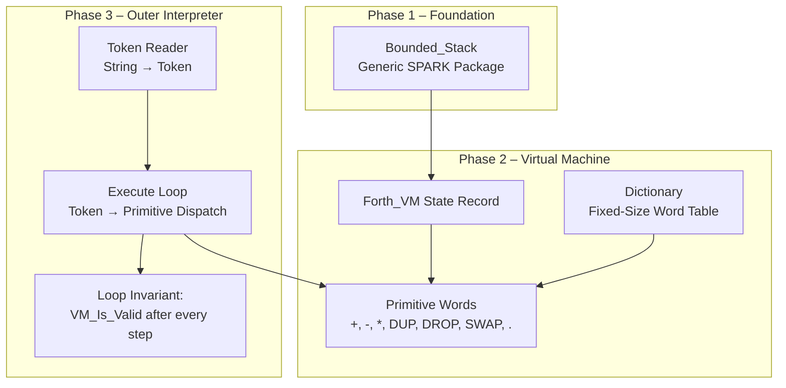
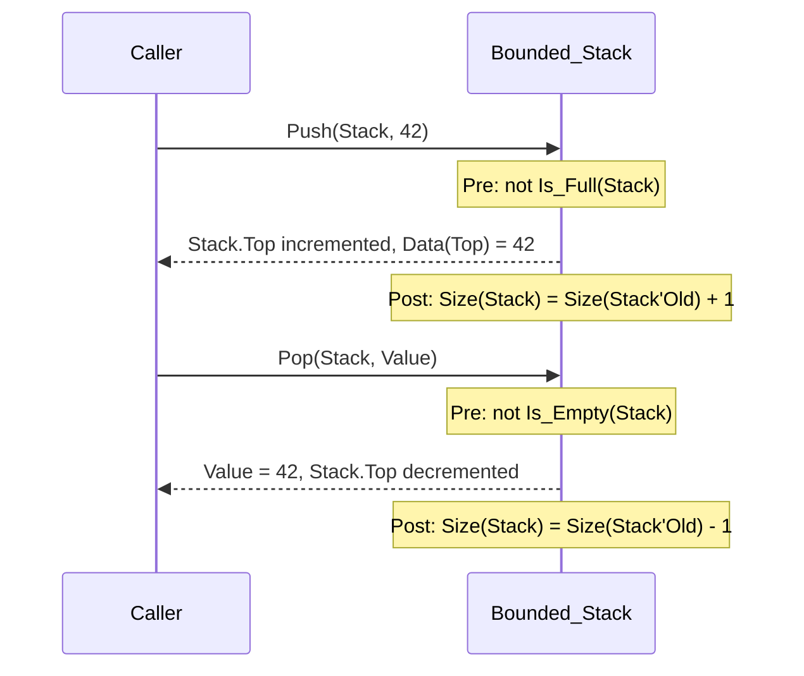
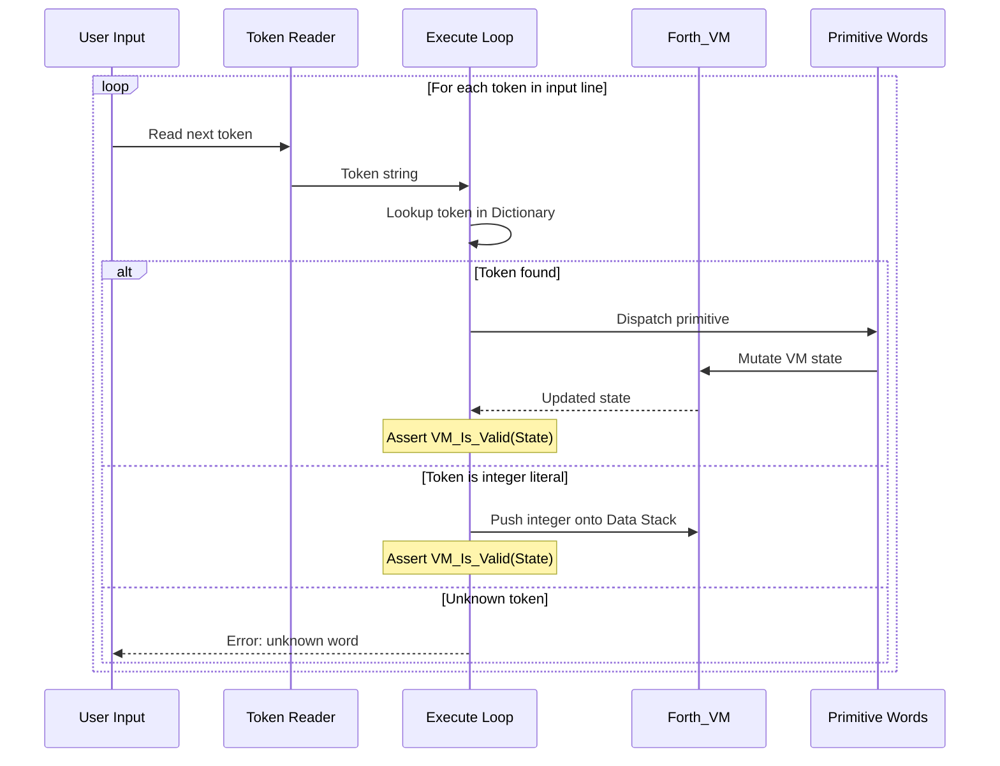

# Design Document: SPARK-Verified Minimal Forth Interpreter

## Overview

This document describes the design of a minimal Forth interpreter implemented entirely within the SPARK 2014 subset of Ada 2012. The system is structured in three phases: a formally verified bounded stack, a Forth virtual machine with primitive word execution, and an outer interpreter loop. Every component operates under `SPARK_Mode => On`, uses zero dynamic memory allocation, and carries formal contracts (preconditions, postconditions, loop invariants, and ghost functions) sufficient for GNATprove to discharge all verification conditions — guaranteeing absence of runtime errors and functional correctness.

The interpreter targets bare-metal or embedded environments where formal assurance of memory safety and absence of overflow/underflow is a hard requirement. The bounded stack is generic over capacity, the VM state is a single flat record with no heap pointers, and the dictionary is a fixed-size array of word entries resolved at elaboration time.

## Architecture



### Layer Dependency

| Layer | Package | Depends On |
|-------|---------|------------|
| Foundation | `Bounded_Stacks` | None (pure, generic) |
| VM | `Forth_VM` | `Bounded_Stacks` |
| Interpreter | `Forth_Interpreter` | `Forth_VM` |

All dependencies flow downward. No circular references exist. Each layer is independently provable by GNATprove.

## Sequence Diagrams

### Phase 1 – Push / Pop Lifecycle



### Phase 3 – Outer Interpreter Loop



## Components and Interfaces

### Component 1: Bounded_Stacks (Generic Package)

**Purpose**: Provide a statically-sized, SPARK-provable integer stack with full functional correctness contracts. This is the foundational data structure for the Forth data stack.

**Interface** (Ada / SPARK):
```ada
generic
   Max_Depth : Positive;
package Bounded_Stacks
  with SPARK_Mode => On
is
   type Stack is private;

   function Is_Empty (S : Stack) return Boolean;
   function Is_Full  (S : Stack) return Boolean;
   function Size     (S : Stack) return Natural;
   function Peek     (S : Stack) return Integer
     with Pre => not Is_Empty (S);

   --  Ghost function: returns the element at logical position I (1-based)
   function Element_At (S : Stack; I : Positive) return Integer
     with Ghost,
          Pre => I >= 1 and then I <= Size (S);

   procedure Push (S : in out Stack; Value : in Integer)
     with Pre  => not Is_Full (S),
          Post => Size (S) = Size (S'Old) + 1
                  and then Peek (S) = Value
                  and then (for all I in 1 .. Size (S'Old) =>
                              Element_At (S, I) = Element_At (S'Old, I));

   procedure Pop (S : in out Stack; Value : out Integer)
     with Pre  => not Is_Empty (S),
          Post => Size (S) = Size (S'Old) - 1
                  and then Value = Peek (S'Old)
                  and then (for all I in 1 .. Size (S) =>
                              Element_At (S, I) = Element_At (S'Old, I));

   Empty_Stack : constant Stack;

private
   subtype Depth_Range is Natural range 0 .. Max_Depth;
   subtype Index_Range is Positive range 1 .. Max_Depth;
   type Data_Array is array (Index_Range) of Integer;

   type Stack is record
      Data : Data_Array := (others => 0);
      Top  : Depth_Range := 0;
   end record;

   Empty_Stack : constant Stack := (Data => (others => 0), Top => 0);
end Bounded_Stacks;
```

**Responsibilities**:
- Guarantee absence of stack overflow on Push via `Pre => not Is_Full`
- Guarantee absence of stack underflow on Pop via `Pre => not Is_Empty`
- Prove functional correctness: Push preserves all existing elements and adds the new one on top; Pop preserves all remaining elements and returns the former top
- Provide ghost function `Element_At` for quantified postconditions without runtime cost

**Why Preconditions Are Necessary for the Prover**:

SPARK's flow analysis and proof engine work by establishing that every possible execution path satisfies the contracts. Without the precondition `not Is_Full(S)` on Push, the prover cannot guarantee that `S.Top + 1` stays within `Depth_Range` — it would need to consider the case where `Top = Max_Depth`, making the increment overflow the subtype constraint and raising `Constraint_Error` at runtime. The precondition eliminates that path from the proof obligation, allowing GNATprove to discharge the verification condition that `Top + 1 in Depth_Range` always holds when Push is called legally. The same logic applies to Pop: without `not Is_Empty(S)`, the prover cannot rule out `Top - 1` underflowing below 0.

In SPARK, preconditions serve as the caller's proof obligation — the caller must demonstrate the precondition holds before the call, and in return the callee guarantees the postcondition. This is the Hoare-logic contract model that makes modular, compositional verification possible.

### Component 2: Forth_VM (VM State)

**Purpose**: Encapsulate the complete Forth virtual machine state as a single flat record with no heap allocation. Provide primitive word implementations with contracts that preserve VM validity.

**Interface** (Ada / SPARK):
```ada
with Bounded_Stacks;

package Forth_VM
  with SPARK_Mode => On
is
   Stack_Capacity   : constant := 256;
   Max_Dict_Entries : constant := 64;
   Max_Word_Length   : constant := 31;

   package Data_Stacks is new Bounded_Stacks (Max_Depth => Stack_Capacity);

   subtype Word_Name is String (1 .. Max_Word_Length);

   type Primitive_Op is (Op_Add, Op_Sub, Op_Mul,
                         Op_Dup, Op_Drop, Op_Swap,
                         Op_Dot, Op_Noop);

   type Dict_Entry is record
      Name   : Word_Name := (others => ' ');
      Length : Natural range 0 .. Max_Word_Length := 0;
      Op     : Primitive_Op := Op_Noop;
   end record;

   type Dict_Array is array (1 .. Max_Dict_Entries) of Dict_Entry;

   type VM_State is record
      Data_Stack : Data_Stacks.Stack := Data_Stacks.Empty_Stack;
      Dictionary : Dict_Array := (others => <>);
      Dict_Size  : Natural range 0 .. Max_Dict_Entries := 0;
      Halted     : Boolean := False;
   end record;

   function VM_Is_Valid (VM : VM_State) return Boolean;

   procedure Initialize (VM : out VM_State)
     with Post => VM_Is_Valid (VM)
                  and then Data_Stacks.Is_Empty (VM.Data_Stack);

   --  Primitive word executors
   procedure Execute_Add  (VM : in out VM_State)
     with Pre  => VM_Is_Valid (VM)
                  and then Data_Stacks.Size (VM.Data_Stack) >= 2,
          Post => VM_Is_Valid (VM);

   procedure Execute_Sub  (VM : in out VM_State)
     with Pre  => VM_Is_Valid (VM)
                  and then Data_Stacks.Size (VM.Data_Stack) >= 2,
          Post => VM_Is_Valid (VM);

   procedure Execute_Mul  (VM : in out VM_State)
     with Pre  => VM_Is_Valid (VM)
                  and then Data_Stacks.Size (VM.Data_Stack) >= 2,
          Post => VM_Is_Valid (VM);

   procedure Execute_Dup  (VM : in out VM_State)
     with Pre  => VM_Is_Valid (VM)
                  and then not Data_Stacks.Is_Empty (VM.Data_Stack)
                  and then not Data_Stacks.Is_Full (VM.Data_Stack),
          Post => VM_Is_Valid (VM);

   procedure Execute_Drop (VM : in out VM_State)
     with Pre  => VM_Is_Valid (VM)
                  and then not Data_Stacks.Is_Empty (VM.Data_Stack),
          Post => VM_Is_Valid (VM);

   procedure Execute_Swap (VM : in out VM_State)
     with Pre  => VM_Is_Valid (VM)
                  and then Data_Stacks.Size (VM.Data_Stack) >= 2,
          Post => VM_Is_Valid (VM);

   procedure Execute_Dot  (VM : in out VM_State)
     with Pre  => VM_Is_Valid (VM)
                  and then not Data_Stacks.Is_Empty (VM.Data_Stack),
          Post => VM_Is_Valid (VM);

end Forth_VM;
```

**Responsibilities**:
- Own the complete VM state in a single record (no pointers, no heap)
- Populate the dictionary with built-in primitives at initialization
- Each primitive executor carries preconditions on minimum stack depth and VM validity
- Each primitive executor guarantees VM validity is preserved (postcondition)
- `VM_Is_Valid` is an expression function that the prover can inline and reason about

### Component 3: Forth_Interpreter (Outer Loop)

**Purpose**: Read tokens from an input line, resolve them against the dictionary or parse as integer literals, and dispatch execution — maintaining a loop invariant that the VM is always in a valid state.

**Interface** (Ada / SPARK):
```ada
with Forth_VM;

package Forth_Interpreter
  with SPARK_Mode => On
is
   Max_Line_Length  : constant := 256;
   Max_Token_Length : constant := 31;

   subtype Line_Buffer is String (1 .. Max_Line_Length);

   type Token is record
      Text   : String (1 .. Max_Token_Length) := (others => ' ');
      Length : Natural range 0 .. Max_Token_Length := 0;
   end record;

   type Interpret_Result is (OK, Unknown_Word, Stack_Error, Halted);

   procedure Interpret_Line
     (VM   : in out Forth_VM.VM_State;
      Line : in     Line_Buffer;
      Len  : in     Natural;
      Res  : out    Interpret_Result)
     with Pre  => Forth_VM.VM_Is_Valid (VM) and then Len <= Max_Line_Length,
          Post => Forth_VM.VM_Is_Valid (VM);

end Forth_Interpreter;
```

**Responsibilities**:
- Tokenize input line into whitespace-delimited tokens (no heap allocation — fixed buffers)
- Look up each token in the VM dictionary
- If found, check stack depth preconditions before dispatching the primitive
- If not found, attempt to parse as an integer literal and push onto the data stack
- If neither, return `Unknown_Word`
- Maintain loop invariant: `VM_Is_Valid(VM)` holds at the start and end of every iteration

## Data Models

### Model 1: Stack (Bounded_Stacks.Stack)

```ada
type Stack is record
   Data : Data_Array := (others => 0);  -- Fixed-size array of integers
   Top  : Depth_Range := 0;             -- Current number of elements (0 = empty)
end record;
```

**Validation Rules**:
- `Top` is always in `0 .. Max_Depth` (enforced by subtype)
- Elements at indices `1 .. Top` are the live stack contents
- Elements at indices `Top + 1 .. Max_Depth` are don't-care (initialized to 0 but not semantically meaningful)
- `Is_Empty` ↔ `Top = 0`
- `Is_Full` ↔ `Top = Max_Depth`

### Model 2: VM_State

```ada
type VM_State is record
   Data_Stack : Data_Stacks.Stack;
   Dictionary : Dict_Array;
   Dict_Size  : Natural range 0 .. Max_Dict_Entries;
   Halted     : Boolean;
end record;
```

**Validation Rules (VM_Is_Valid)**:
- `Dict_Size` is in `0 .. Max_Dict_Entries`
- All dictionary entries at indices `1 .. Dict_Size` have `Length > 0`
- `Halted = False` (VM is still running) — or the interpreter stops dispatching
- The data stack's internal invariants hold (enforced by `Bounded_Stacks` contracts)

### Model 3: Dict_Entry

```ada
type Dict_Entry is record
   Name   : Word_Name;   -- Fixed 31-character buffer, padded with spaces
   Length : Natural range 0 .. Max_Word_Length;  -- Actual name length
   Op     : Primitive_Op; -- Which primitive this entry maps to
end record;
```

**Validation Rules**:
- `Length > 0` for all active entries
- `Name(1 .. Length)` contains the meaningful characters
- `Op /= Op_Noop` for all active entries

## Key Functions with Formal Specifications

### Function 1: Push

```ada
procedure Push (S : in out Stack; Value : in Integer)
  with Pre  => not Is_Full (S),
       Post => Size (S) = Size (S'Old) + 1
               and then Peek (S) = Value
               and then (for all I in 1 .. Size (S'Old) =>
                           Element_At (S, I) = Element_At (S'Old, I));
```

**Preconditions:**
- `not Is_Full(S)` — `S.Top < Max_Depth`, guaranteeing `S.Top + 1` does not overflow `Depth_Range`

**Postconditions:**
- Stack size increases by exactly 1
- The new top element equals `Value`
- All previously existing elements are unchanged (frame condition via `Element_At` quantification)

**Loop Invariants:** N/A (no loops)

### Function 2: Pop

```ada
procedure Pop (S : in out Stack; Value : out Integer)
  with Pre  => not Is_Empty (S),
       Post => Size (S) = Size (S'Old) - 1
               and then Value = Peek (S'Old)
               and then (for all I in 1 .. Size (S) =>
                           Element_At (S, I) = Element_At (S'Old, I));
```

**Preconditions:**
- `not Is_Empty(S)` — `S.Top > 0`, guaranteeing `S.Top - 1` does not underflow below 0

**Postconditions:**
- Stack size decreases by exactly 1
- `Value` receives the element that was on top before the call
- All remaining elements are unchanged

**Loop Invariants:** N/A (no loops)

### Function 3: Execute_Add

```ada
procedure Execute_Add (VM : in out VM_State)
  with Pre  => VM_Is_Valid (VM)
               and then Data_Stacks.Size (VM.Data_Stack) >= 2,
       Post => VM_Is_Valid (VM);
```

**Preconditions:**
- VM is in a valid state
- Data stack has at least 2 elements (required for two Pops)

**Postconditions:**
- VM remains in a valid state
- (Informally: top two elements are replaced by their sum; net stack depth decreases by 1)

**Implementation sketch:**
```ada
procedure Execute_Add (VM : in out VM_State) is
   A, B : Integer;
begin
   Data_Stacks.Pop (VM.Data_Stack, A);
   Data_Stacks.Pop (VM.Data_Stack, B);
   --  Note: overflow on A + B is a separate concern;
   --  for Phase 2 we may use saturating arithmetic or
   --  add a precondition on value ranges.
   Data_Stacks.Push (VM.Data_Stack, A + B);
end Execute_Add;
```

**Loop Invariants:** N/A (no loops)

### Function 4: Interpret_Line

```ada
procedure Interpret_Line
  (VM   : in out Forth_VM.VM_State;
   Line : in     Line_Buffer;
   Len  : in     Natural;
   Res  : out    Interpret_Result)
  with Pre  => Forth_VM.VM_Is_Valid (VM) and then Len <= Max_Line_Length,
       Post => Forth_VM.VM_Is_Valid (VM);
```

**Preconditions:**
- VM is valid
- `Len` does not exceed buffer size

**Postconditions:**
- VM is valid regardless of which branch was taken (success, error, or halt)
- `Res` indicates the outcome

**Loop Invariant (token processing loop):**
```ada
--  Inside the token-scanning loop:
pragma Loop_Invariant (Forth_VM.VM_Is_Valid (VM));
pragma Loop_Invariant (Pos in 1 .. Len + 1);
```
- `VM_Is_Valid(VM)` holds at every iteration boundary — this is the key invariant that lets GNATprove verify the entire interpreter loop
- `Pos` stays within the valid scanning range

## Algorithmic Pseudocode

### Interpret_Line Algorithm

```ada
procedure Interpret_Line
  (VM : in out VM_State; Line : in Line_Buffer;
   Len : in Natural; Res : out Interpret_Result)
is
   Pos : Natural := 1;
   Tok : Token;
begin
   Res := OK;

   while Pos <= Len and then Res = OK loop
      pragma Loop_Invariant (VM_Is_Valid (VM));
      pragma Loop_Invariant (Pos in 1 .. Len + 1);

      --  Skip whitespace
      Skip_Spaces (Line, Len, Pos);
      exit when Pos > Len;

      --  Extract next token
      Read_Token (Line, Len, Pos, Tok);

      --  Try dictionary lookup
      declare
         Found : Boolean;
         Op    : Primitive_Op;
      begin
         Lookup (VM.Dictionary, VM.Dict_Size, Tok, Found, Op);

         if Found then
            --  Check stack depth precondition for this op
            if Has_Enough_Operands (VM.Data_Stack, Op) then
               Dispatch (VM, Op);
            else
               Res := Stack_Error;
            end if;
         else
            --  Try parsing as integer literal
            declare
               Value   : Integer;
               Parsed  : Boolean;
            begin
               Try_Parse_Integer (Tok, Value, Parsed);
               if Parsed and then not Data_Stacks.Is_Full (VM.Data_Stack) then
                  Data_Stacks.Push (VM.Data_Stack, Value);
               elsif Parsed then
                  Res := Stack_Error;  -- stack full
               else
                  Res := Unknown_Word;
               end if;
            end;
         end if;
      end;
   end loop;
end Interpret_Line;
```

### Dispatch Algorithm

```ada
procedure Dispatch (VM : in out VM_State; Op : in Primitive_Op)
  with Pre  => VM_Is_Valid (VM)
               and then Has_Enough_Operands (VM.Data_Stack, Op),
       Post => VM_Is_Valid (VM)
is
begin
   case Op is
      when Op_Add  => Execute_Add (VM);
      when Op_Sub  => Execute_Sub (VM);
      when Op_Mul  => Execute_Mul (VM);
      when Op_Dup  => Execute_Dup (VM);
      when Op_Drop => Execute_Drop (VM);
      when Op_Swap => Execute_Swap (VM);
      when Op_Dot  => Execute_Dot (VM);
      when Op_Noop => null;
   end case;
end Dispatch;
```

## Example Usage

```ada
with Forth_VM;
with Forth_Interpreter;
with Ada.Text_IO;

procedure Main
  with SPARK_Mode => Off  --  Main uses Text_IO (not in SPARK subset)
is
   VM   : Forth_VM.VM_State;
   Line : Forth_Interpreter.Line_Buffer := (others => ' ');
   Res  : Forth_Interpreter.Interpret_Result;
   Input : constant String := "3 4 + DUP * .";
begin
   Forth_VM.Initialize (VM);

   --  Copy input into fixed buffer
   Line (1 .. Input'Length) := Input;

   Forth_Interpreter.Interpret_Line (VM, Line, Input'Length, Res);

   case Res is
      when Forth_Interpreter.OK =>
         Ada.Text_IO.Put_Line ("OK");
      when Forth_Interpreter.Unknown_Word =>
         Ada.Text_IO.Put_Line ("Error: unknown word");
      when Forth_Interpreter.Stack_Error =>
         Ada.Text_IO.Put_Line ("Error: stack underflow/overflow");
      when Forth_Interpreter.Halted =>
         Ada.Text_IO.Put_Line ("VM halted");
   end case;
end Main;
```

Expected execution trace for `"3 4 + DUP * ."`:
1. Push 3 → stack: [3]
2. Push 4 → stack: [3, 4]
3. `+` → pop 4 and 3, push 7 → stack: [7]
4. `DUP` → push copy of 7 → stack: [7, 7]
5. `*` → pop 7 and 7, push 49 → stack: [49]
6. `.` → pop and print 49 → stack: [] — output: `49`

## Correctness Properties

The following properties are universally quantified over all valid inputs and states:

1. **Stack Overflow Absence**: ∀ S : Stack, V : Integer · `not Is_Full(S)` ⟹ `Push(S, V)` terminates without `Constraint_Error`
2. **Stack Underflow Absence**: ∀ S : Stack · `not Is_Empty(S)` ⟹ `Pop(S, _)` terminates without `Constraint_Error`
3. **Push-Pop Identity**: ∀ S : Stack, V : Integer · `not Is_Full(S)` ⟹ let S' = Push(S, V) in Pop(S') yields (S, V)
4. **Size Monotonicity**: `Size(Push(S, V)) = Size(S) + 1` and `Size(Pop(S)) = Size(S) - 1`
5. **Frame Preservation**: Push and Pop do not modify elements below the top
6. **VM Validity Preservation**: ∀ VM : VM_State, Op : Primitive_Op · `VM_Is_Valid(VM) ∧ Has_Enough_Operands(VM, Op)` ⟹ `VM_Is_Valid(Dispatch(VM, Op))`
7. **Interpreter Loop Invariant**: At every iteration boundary of `Interpret_Line`, `VM_Is_Valid(VM)` holds
8. **No Dynamic Allocation**: The entire system uses only stack-allocated and statically-sized objects — verifiable by SPARK flow analysis (no access types)

## Error Handling

### Error Scenario 1: Stack Underflow Attempt

**Condition**: A primitive requires N operands but the data stack has fewer than N elements
**Response**: `Interpret_Line` returns `Stack_Error` without executing the primitive
**Recovery**: The VM state is unchanged; the caller can report the error and continue with a new input line

### Error Scenario 2: Stack Overflow on Push

**Condition**: An integer literal is parsed but the data stack is full (`Is_Full` returns True)
**Response**: `Interpret_Line` returns `Stack_Error` without pushing
**Recovery**: VM state unchanged; caller reports error

### Error Scenario 3: Unknown Word

**Condition**: A token is neither found in the dictionary nor parseable as an integer
**Response**: `Interpret_Line` returns `Unknown_Word`
**Recovery**: VM state unchanged; caller reports the unrecognized token

### Error Scenario 4: Integer Arithmetic Overflow

**Condition**: `A + B`, `A - B`, or `A * B` exceeds `Integer'Range`
**Response**: Phase 2 design decision — options include saturating arithmetic, wrapping arithmetic, or adding value-range preconditions. The recommended approach is to use `Integer` range checks and return `Stack_Error` if overflow would occur, keeping the VM provably safe.
**Recovery**: VM state unchanged if overflow is caught before mutation

## Testing Strategy

### GNATprove Verification (Primary)

The primary "testing" strategy is formal verification via GNATprove:
- Run `gnatprove -P project.gpr --level=2 --prover=z3,cvc5` on each phase
- All verification conditions (VCs) must be discharged (green)
- Target: zero unproved VCs for absence of runtime errors (AoRTE)
- Target: zero unproved VCs for functional correctness contracts

### Unit Testing Approach

Supplement formal verification with AUnit test cases for runtime behavior:
- Test Push/Pop sequences and verify returned values
- Test each primitive word in isolation
- Test `Interpret_Line` with known Forth expressions and verify output
- Edge cases: empty stack operations, full stack operations, maximum-length tokens

### Property-Based Testing Approach

**Property Test Library**: Not directly applicable (Ada ecosystem lacks a mainstream PBT library), but the formal contracts serve the same role — GNATprove checks properties over all possible inputs, which is strictly stronger than PBT.

If runtime PBT is desired, a simple harness can generate random Push/Pop sequences and assert the contracts hold at each step.

### Integration Testing Approach

- End-to-end test: feed complete Forth programs (e.g., `"3 4 + ."`) through `Main` and verify console output
- Stress test: maximum stack depth sequences
- Dictionary lookup: verify all 7 primitives are correctly registered and dispatched

## Performance Considerations

- All data structures are stack-allocated with known compile-time sizes — zero heap allocation
- Dictionary lookup is linear scan over at most 64 entries — acceptable for a minimal interpreter; could be optimized with a hash table in a future phase
- Stack operations are O(1) — single array index read/write
- Ghost functions and loop invariants have zero runtime cost (erased by the compiler)
- Total static memory footprint: ~1 KB for the data stack (256 × 4 bytes) + ~2 KB for the dictionary (64 × 32 bytes) + line buffer (256 bytes) ≈ 3.5 KB

## Security Considerations

- SPARK verification guarantees absence of buffer overflows, index-out-of-range, and integer overflow (when contracts are fully discharged)
- No dynamic memory allocation eliminates use-after-free, double-free, and memory leak classes entirely
- No access types (pointers) are used — eliminates null dereference
- The interpreter does not execute arbitrary code — only dispatches to a fixed set of primitive operations
- Input is bounded by `Max_Line_Length` — no unbounded reads

## Dependencies

| Dependency | Purpose | SPARK Compatible |
|------------|---------|-----------------|
| Ada.Text_IO | Console output for `.` (dot) primitive and Main | No (used only in `SPARK_Mode => Off` wrappers) |
| GNAT Community / GNAT Pro | Compiler and prover toolchain | Yes |
| GNATprove | Formal verification engine | Yes |
| z3 / cvc5 | SMT solvers (used by GNATprove) | N/A (external tools) |

No third-party libraries are required. The entire implementation uses only Ada standard library facilities, and the SPARK-verified core uses none of them (pure computation).
